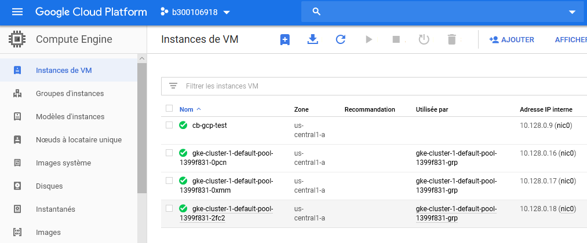
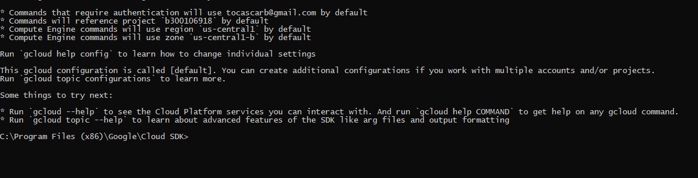
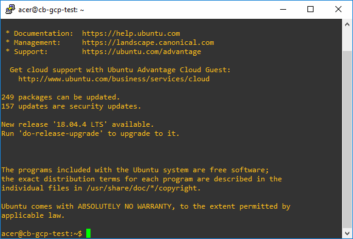

# Kubernetes

Ce laboratoire permettra de créer une grappe (cluster) Kubernetes sur GCP (Google Cloud Platform).

:closed_book: Copiez le `README.md` dans votre répertoire et cocher les sections `- [x]` au fur et à mesure de votre progression.

## :o: Sur votre PC, créer votre répertoire de travail dans `git bash`

- [x] Dans le répertoire `4.Kubernetes` Créer un répertoire avec comme nom, votre :id:

`$ mkdir ` :id:

- [x] Copier le fichier se trouvant dans le repretoire `.` dans votre répertoire

      * incluant le fichier `README.md` 

`$ cp ./README.md `:id:` `

- [x] Soumettre votre répertoire de travail vers github `(git add, commit, push)` 

## :a: Dans votre Serveur Windows du laboratoire

## :star: Prérequis

Etapes: 

- [x]  Ouvrir son compte GCP

- [x]  Configurer son environnement GCP

- [x]  Créer sa première VM avec GCP
- [x]  Créer son premier cluster Kubernetes avec GCP

- [x]  gcloud CLI

- [x]  Se connecter à une machine existante avec ssh

## References

https://kube.academy/

| Titre | Description |
|-------|-------------|
| [Docker In Action](https://www.manning.com/books/docker-in-action-second-edition) | [Chapitre 1](https://livebook.manning.com/book/kubernetes-in-action/chapter-1) |

