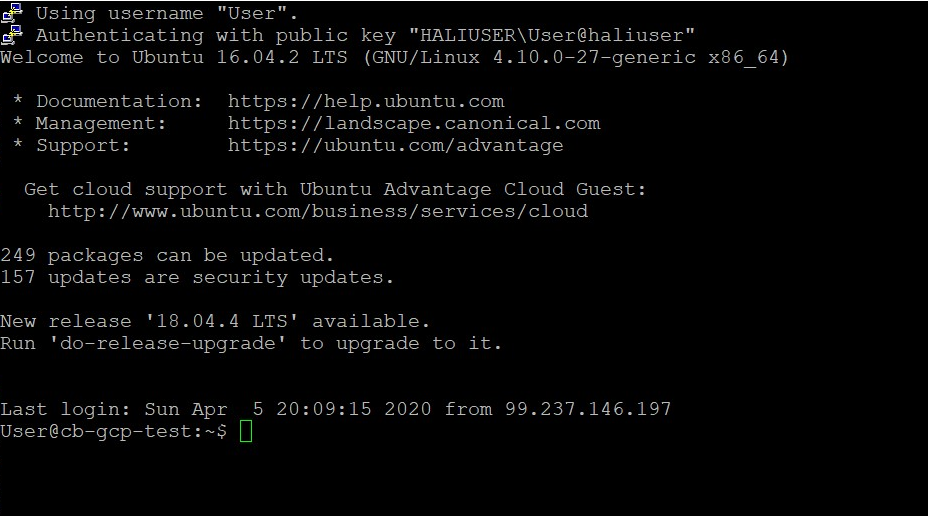

# Kubernetes

Ce laboratoire permettra de créer une grappe (cluster) Kubernetes sur GCP (Google Cloud Platform).

:closed_book: Copiez le `README.md` dans votre répertoire et cocher les sections `- [x]` au fur et à mesure de votre progression.

## :o: Sur votre PC, créer votre répertoire de travail dans `git bash`

- [x] Dans le répertoire `4.Kubernetes` Créer un répertoire avec comme nom, votre :id:

`$ mkdir ` :id:

- [x] Copier le fichier se trouvant dans le repretoire `.` dans votre répertoire

      * incluant le fichier `README.md` 


`$ cp ./README.md `:id:` `

- [x] Soumettre votre répertoire de travail vers github `(git add, commit, push)` 

## :a: Dans votre Serveur Windows du laboratoire

## :star: Prérequis

Etapes: 

# - [x]  Ouvrir son compte GCP

# - [x]  Configurer son environnement GCP

```
Welcome to the Google Cloud SDK! Run "gcloud -h" to get the list of available commands.
---

C:\Program Files (x86)\Google\Cloud SDK>gcloud init
Welcome! This command will take you through the configuration of gcloud.

Settings from your current configuration [default] are:
core:
  account: halimafd79@gmail.com
  disable_usage_reporting: 'True'
  project: excellent-bolt-272914

Pick configuration to use:
 [1] Re-initialize this configuration [default] with new settings
 [2] Create a new configuration
Please enter your numeric choice:  1

Your current configuration has been set to: [default]

You can skip diagnostics next time by using the following flag:
  gcloud init --skip-diagnostics

Network diagnostic detects and fixes local network connection issues.
Checking network connection...done.
Reachability Check passed.
Network diagnostic passed (1/1 checks passed).

Choose the account you would like to use to perform operations for
this configuration:
 [1] halimafd79@gmail.com
 [2] Log in with a new account
Please enter your numeric choice:  1

You are logged in as: [halimafd79@gmail.com].

Pick cloud project to use:
 [1] excellent-bolt-272914
 [2] Create a new project
Please enter numeric choice or text value (must exactly match list
item):  1

Your current project has been set to: [excellent-bolt-272914].

Do you want to configure a default Compute Region and Zone? (Y/n)?  y

Which Google Compute Engine zone would you like to use as project
default?
If you do not specify a zone via a command line flag while working
with Compute Engine resources, the default is assumed.
 [1] us-east1-b
 [2] us-east1-c
 [3] us-east1-d
 [4] us-east4-c
 [5] us-east4-b
 [6] us-east4-a
 [7] us-central1-c
 [8] us-central1-a
 [9] us-central1-f
 [10] us-central1-b
 [11] us-west1-b
 [12] us-west1-c
 [13] us-west1-a
 [14] europe-west4-a
 [15] europe-west4-b
 [16] europe-west4-c
 [17] europe-west1-b
 [18] europe-west1-d
 [19] europe-west1-c
 [20] europe-west3-c
 [21] europe-west3-a
 [22] europe-west3-b
 [23] europe-west2-c
 [24] europe-west2-b
 [25] europe-west2-a
 [26] asia-east1-b
 [27] asia-east1-a
 [28] asia-east1-c
 [29] asia-southeast1-b
 [30] asia-southeast1-a
 [31] asia-southeast1-c
 [32] asia-northeast1-b
 [33] asia-northeast1-c
 [34] asia-northeast1-a
 [35] asia-south1-c
 [36] asia-south1-b
 [37] asia-south1-a
 [38] australia-southeast1-b
 [39] australia-southeast1-c
 [40] australia-southeast1-a
 [41] southamerica-east1-b
 [42] southamerica-east1-c
 [43] southamerica-east1-a
 [44] asia-east2-a
 [45] asia-east2-b
 [46] asia-east2-c
 [47] asia-northeast2-a
 [48] asia-northeast2-b
 [49] asia-northeast2-c
 [50] asia-northeast3-a
Did not print [18] options.
Too many options [68]. Enter "list" at prompt to print choices fully.
Please enter numeric choice or text value (must exactly match list
item):  8

Your project default Compute Engine zone has been set to [us-central1-a].
You can change it by running [gcloud config set compute/zone NAME].

Your project default Compute Engine region has been set to [us-central1].
You can change it by running [gcloud config set compute/region NAME].

Created a default .boto configuration file at [C:\Users\User\.boto]. See this file and
[https://cloud.google.com/storage/docs/gsutil/commands/config] for more
information about configuring Google Cloud Storage.
Your Google Cloud SDK is configured and ready to use!

* Commands that require authentication will use halimafd79@gmail.com by default
* Commands will reference project `excellent-bolt-272914` by default
* Compute Engine commands will use region `us-central1` by default
* Compute Engine commands will use zone `us-central1-a` by default

Run `gcloud help config` to learn how to change individual settings

This gcloud configuration is called [default]. You can create additional configurations if you work with multiple accounts and/or projects.
Run `gcloud topic configurations` to learn more.

Some things to try next:

* Run `gcloud --help` to see the Cloud Platform services you can interact with. And run `gcloud help COMMAND` to get help on any gcloud command.
* Run `gcloud topic --help` to learn about advanced features of the SDK like arg files and output formatting

```
# GCP CLI
## 📌 Explorer gcloud
```
C:\Program Files (x86)\Google\Cloud SDK>gcloud beta compute ssh --zone "us-central1-a" "cb-gcp-test" --project "b300108234"
You do not currently have this command group installed.  Using it
requires the installation of components: [beta]


Your current Cloud SDK version is: 288.0.0
Installing components from version: 288.0.0

┌─────────────────────────────────────────────┐
│     These components will be installed.     │
├──────────────────────┬────────────┬─────────┤
│         Name         │  Version   │   Size  │
├──────────────────────┼────────────┼─────────┤
│ gcloud Beta Commands │ 2019.05.17 │ < 1 MiB │
└──────────────────────┴────────────┴─────────┘

For the latest full release notes, please visit:
  https://cloud.google.com/sdk/release_notes

Do you want to continue (Y/n)?  y

╔════════════════════════════════════════════════════════════╗
╠═ Creating update staging area                             ═╣
╠════════════════════════════════════════════════════════════╣
╠═ Installing: gcloud Beta Commands                         ═╣
╠════════════════════════════════════════════════════════════╣
╠═ Creating backup and activating new installation          ═╣
╚════════════════════════════════════════════════════════════╝

Performing post processing steps...done.

Update done!

WARNING:   There are older versions of Google Cloud Platform tools on your system PATH.
 

Appuyez sur une touche pour continuer...

```
## 📌 Connection par le browser
```
C:\Program Files (x86)\Google\Cloud SDK>gcloud auth login
Your browser has been opened to visit:

    https://accounts.google.com/o/oauth2/auth?code_challenge=4-L93JzWe2dOF9wj7TfDOU_gl7pMagZ0dfsoy2EuQ4s&prompt=select_account&code_challenge_method=S256&access_type=offline&redirect_uri=http%3A%2F%2Flocalhost%3A8085%2F&response_type=code&client_id=32555940559.apps.googleusercontent.com&scope=openid+https%3A%2F%2Fwww.googleapis.com%2Fauth%2Fuserinfo.email+https%3A%2F%2Fwww.googleapis.com%2Fauth%2Fcloud-platform+https%3A%2F%2Fwww.googleapis.com%2Fauth%2Fappengine.admin+https%3A%2F%2Fwww.googleapis.com%2Fauth%2Fcompute+https%3A%2F%2Fwww.googleapis.com%2Fauth%2Faccounts.reauth


You are now logged in as [halimafd79@gmail.com].
Your current project is [excellent-bolt-272914].  You can change this setting by running:
  $ gcloud config set project PROJECT_ID

```
## 📌 Set le projet
```
C:\Program Files (x86)\Google\Cloud SDK>gcloud config set project excellent-bolt-272914
Updated property [core/project].
```
## 📌 Creer sa cle SSH en se connectant a la machine

```
C:\Program Files (x86)\Google\Cloud SDK>gcloud beta compute ssh --zone us-central1-a cb-gcp-test --project excellent-bolt-272914

Updating instance ssh metadata...\Updated [https://www.googleapis.com/compute/beta/projects/excellent-bolt-272914/zones/us-central1-a/instances/cb-gcp-test].
Updating instance ssh metadata...done.
Waiting for SSH key to propagate.
The server's host key is not cached in the registry. You
have no guarantee that the server is the computer you
think it is.
The server's ssh-ed25519 key fingerprint is:
ssh-ed25519 255 86:49:1e:38:65:f9:3c:75:0c:c4:6b:99:49:8c:cd:0d
If you trust this host, enter "y" to add the key to
PuTTY's cache and carry on connecting.
If you want to carry on connecting just once, without
adding the key to the cache, enter "n".
If you do not trust this host, press Return to abandon the connection.
Store key in cache? (y/n) y

Using username "User".
Authenticating with public key "HALIUSER\User@haliuser"
Welcome to Ubuntu 16.04.2 LTS (GNU/Linux 4.10.0-27-generic x86_64)

 * Documentation:  https://help.ubuntu.com
 * Management:     https://landscape.canonical.com
 * Support:        https://ubuntu.com/advantage

  Get cloud support with Ubuntu Advantage Cloud Guest:
    http://www.ubuntu.com/business/services/cloud

130 packages can be updated.
2 updates are security updates.

New release '18.04.4 LTS' available.
Run 'do-release-upgrade' to upgrade to it.


*** System restart required ***
User@cb-gcp-test:~$

```
</img>

📌 Fichier de cles SSH cree
```
$ ls -l ~/.ssh/google_compute_*
-rw-r--r-- 1 User 197121 1675 avr.   4 10:12 /c/Users/User/.ssh/google_compute_engine
-rw-r--r-- 1 User 197121 1440 avr.   4 10:12 /c/Users/User/.ssh/google_compute_engine.ppk
-rw-r--r-- 1 User 197121  404 avr.   4 10:12 /c/Users/User/.ssh/google_compute_engine.pub

```


# - [x]  Créer sa première VM avec GCP

- Docker Machine sous GCP

## 📌 Vérifier que vos identifiants `cloud` sont installés

```
~/.gcp/b300108234-de32988388af.json

```
📌 Ajouter la variable d'identifiants à son Environement

```
$ export GOOGLE_APPLICATION_CREDENTIALS="$HOME/.gcp/b300108234-de32988388af.json"
```


📌 repérer son numero de projet excellent-bolt-272914

```
$ docker-machine create --driver google --google-project excellent-bolt-272914 cb-gcp-test
Running pre-create checks...
(cb-gcp-test) Check that the project exists
(cb-gcp-test) Check if the instance already exists
Creating machine...
(cb-gcp-test) Generating SSH Key
(cb-gcp-test) Creating host...
(cb-gcp-test) Opening firewall ports
(cb-gcp-test) Creating instance
(cb-gcp-test) Waiting for Instance
(cb-gcp-test) Uploading SSH Key
Waiting for machine to be running, this may take a few minutes...
Detecting operating system of created instance...
Waiting for SSH to be available...
Detecting the provisioner...
Provisioning with ubuntu(systemd)...
Installing Docker...
Copying certs to the local machine directory...
Copying certs to the remote machine...
Setting Docker configuration on the remote daemon...
Checking connection to Docker...
Docker is up and running!
To see how to connect your Docker Client to the Docker Engine running on this virtual machine, run: C:\Program Files\Docker\Docker\Resources\bin\docker-machine.exe env cb-gcp-test

```

- [x]  Créer son premier cluster Kubernetes avec GCP

```
$ gcloud container clusters create kubia --num-nodes 3 --machine-type f1-micro --zone "us-central1-a"

WARNING: Currently VPC-native is not the default mode during cluster creation. In the future, this will become the default mode and can be disabled using `--no-enable-ip-alias` flag. Use `--[no-]enable-ip-alias` flag to suppress this warning.
WARNING: Newly created clusters and node-pools will have node auto-upgrade enabled by default. This can be disabled using the `--no-enable-autoupgrade` flag.
WARNING: Starting with version 1.18, clusters will have shielded GKE nodes by default.
WARNING: Your Pod address range (`--cluster-ipv4-cidr`) can accommodate at most 1008 node(s).
This will enable the autorepair feature for nodes. Please see https://cloud.google.com/kubernetes-engine/docs/node-auto-repair for more information on node autorepairs.
Creating cluster kubia in us-central1-a... Cluster is being health-checked (master is health
y)...done.
Created [https://container.googleapis.com/v1/projects/excellent-bolt-272914/zones/us-central1-a/clusters/kubia].
To inspect the contents of your cluster, go to: https://console.cloud.google.com/kubernetes/workload_/gcloud/us-central1-a/kubia?project=excellent-bolt-272914
kubeconfig entry generated for kubia.
NAME   LOCATION       MASTER_VERSION  MASTER_IP       MACHINE_TYPE  NODE_VERSION    NUM_NODES  STATUS
kubia  us-central1-a  1.14.10-gke.27  35.202.149.132  f1-micro      1.14.10-gke.27  3          RUNNING


```

## :b: kubectl Avec [GCP](Google Cloud Platform)

https://www.linkedin.com/learning/l-essentiel-de-kubernetes/creer-son-premier-pod?u=56968449

### :star: Taches

- [x]  Créer son premier pod

* Créer un repertoire sous le nom de labPod

 ```
$ mkdir labPod           
$ cd labpod
```

* Créer un ficher de specification dans cette exemple c'est pour lancer un serveur web
```
$ nano web.ylm
```

```
$ cat web.yml
apiVersion: v1
kind: Pod
metadata:
  name: web
spec:
  containers:
  - name: nginx
    image: nginx:1.17-alpine
```
* Creation du 1 er Pod en applicant les specification du fishier web.yml

``` 
$ kubectl apply -f .\web.yml
pod/web created
```
* Verification
```
$ kubectl get pods
NAME   READY   STATUS    RESTARTS   AGE
web    1/1     Running   0          6m54s
```
* Pour voir la description du Pod:
```
kubectl describe pod/web
Name:               web
Namespace:          default
PriorityClassName:  <none>
Start Time:         Sun, 12 Apr 2020 15:14:35 -0400
Labels:             <none>
Annotations:        kubectl.kubernetes.io/last-applied-configuration:
                      {"apiVersion":"v1","kind":"Pod","metadata":{"annotations":{},"name":"web","namespace":"default"},"spec":{"containers":[{"image":"nginx:1.1...
                    kubernetes.io/limit-ranger: LimitRanger plugin set: cpu request for container nginx
Status:             Running
IP:                 10.52.1.2
Containers:
  nginx:
    Container ID:   docker://ff9cd72a28d1ed2c38cd5398f7fd2fde41f789b7f4b4668451c895eeffe42b04
    Image:          nginx:1.17-alpine
    Image ID:       docker-pullable://nginx@sha256:abe5ce652eb78d9c793df34453fddde12bb4d93d9fbf2c363d0992726e4d2cad
    Port:           <none>
    Host Port:      <none>
    State:          Running
      Started:      Sun, 12 Apr 2020 15:16:29 -0400
    Ready:          True
    Restart Count:  0
    Requests:
      cpu:        100m
    Environment:  <none>
    Mounts:
      /var/run/secrets/kubernetes.io/serviceaccount from default-token-sccg7 (ro)
Conditions:
  Type              Status
  Initialized       True
  Ready             False
  ContainersReady   True
  PodScheduled      True
Volumes:
  default-token-sccg7:
    Type:        Secret (a volume populated by a Secret)
    SecretName:  default-token-sccg7
    Optional:    false
QoS Class:       Burstable
Node-Selectors:  <none>
Tolerations:     node.kubernetes.io/not-ready:NoExecute for 300s
                 node.kubernetes.io/unreachable:NoExecute for 300s
Events:
  Type     Reason            Age                   From                                           Message
  ----     ------            ----                  ----                                           -------
  Warning  FailedScheduling  5m52s (x3 over 7m4s)  default-scheduler                              0/3 nodes are available: 3 node(s) had taints that the pod didn't tolerate.
  Normal   Scheduled         4m40s                 default-scheduler                              Successfully assigned default/web to gke-kubia-default-pool-feccf4b5-fv0k
  Normal   Pulling           4m15s                 kubelet, gke-kubia-default-pool-feccf4b5-fv0k  Pulling image "nginx:1.17-alpine"
  Normal   Pulled            3m5s                  kubelet, gke-kubia-default-pool-feccf4b5-fv0k  Successfully pulled image "nginx:1.17-alpine"
  Normal   Created           3m2s                  kubelet, gke-kubia-default-pool-feccf4b5-fv0k  Created container nginx
  Normal   Started           2m42s                 kubelet, gke-kubia-default-pool-feccf4b5-fv0k  Started container nginx

```


### Référence GCP

* Créer son environment GCP (incluant la console)

https://github.com/CollegeBoreal/Tutoriels/tree/master/2.Virtualisation/4.Cloud/2.Public/4.GCP

* Gérer sa grapper Kubernetes (avec `kubectl`)

https://github.com/CollegeBoreal/Tutoriels/tree/master/2.Virtualisation/3.Orchestration/1.Kubernetes


## References

https://kube.academy/

| Titre | Description |
|-------|-------------|
| [Kubernetes In Action](https://www.manning.com/books/kubernetes-in-action) | [Chapitre 1](https://livebook.manning.com/book/kubernetes-in-action/chapter-1) |

:tada: Demo:

https://github.com/GoogleCloudPlatform/microservices-demo


## References

https://kube.academy/
