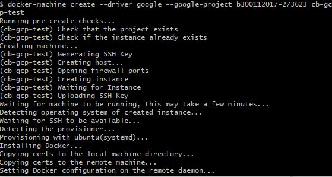
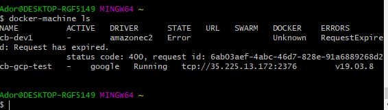
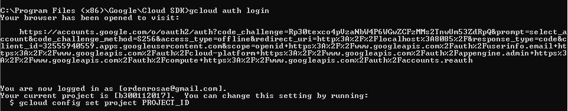

# Kubernetes

Ce laboratoire permettra de créer une grappe (cluster) Kubernetes sur GCP (Google Cloud Platform).

:closed_book: Copiez le `README.md` dans votre répertoire et cocher les sections `- [x]` au fur et à mesure de votre progression.

## :o: Sur votre PC, créer votre répertoire de travail dans `git bash`

- [✔ ] Dans le répertoire `4.Kubernetes` Créer un répertoire avec comme nom, votre :id:

`$ mkdir ` :id:

- [✔ ] Copier le fichier se trouvant dans le repretoire `.` dans votre répertoire

      * incluant le fichier `README.md` 


`$ cp ./README.md `:id:` `

- [ ✔] Soumettre votre répertoire de travail vers github `(git add, commit, push)` 

## :a: Dans votre Serveur Windows du laboratoire

## :star: Prérequis

Etapes: 

- [✔ ]  Ouvrir son compte GCP

- [✔ ]  Configurer son environnement GCP

- [ ✔]  Créer sa première VM avec GCP

</img>

</img>


- [✔ ]  Créer son premier cluster Kubernetes avec GCP


# GCP - Google Cloud Platform

## :one: GCP Console

https://console.cloud.google.com

## :two: Configuration 

### :pushpin: Create a Service Account

https://cloud.google.com/docs/authentication/production#creating_a_service_account


## Créer son environment GCP (incluant la console)

1. In the Cloud Console, go to the Create service account key page.
    
    **Go to the Create Service Account Key page**
    
2. From the `Service account` list, select `New service account`.

3. In the Service account name field, enter a name.

4. From the `Role` list, select `Project > Owner`.

:star:
Note: The Role field authorizes your service account to access resources. 
You can view and change this field later by using the Cloud Console. 
If you are developing a production app, specify more granular permissions than `Project > Owner`. 
For more information, see [granting role` to service accounts](https://cloud.google.com/iam/docs/granting-roles-to-service-accounts).

5. Click `Create`. A JSON file that contains your key downloads to your computer.

* Le fichier téléchargé sera sauvegarder dans le répertoire `~/.gcp` Créer le répertoire au préalable.

Example: ajuster avec le nom de fichier `identifiants`

```
~/.gcp/b300112017-790eba8c76.json
```

6. Ajouter la variable d'identifiants à son` Environement`

https://cloud.google.com/docs/authentication/getting-started#setting_the_environment_variable

Example: ajuster avec le nom de fichier `identifiants`

```
% export GOOGLE_APPLICATION_CREDENTIALS="$HOME/.gcp/b300112017-273623-790eba8c76.json"
```
 
 ## Gérer son environnement avec gcloud CLI
 
 
 ## 1- Installer gcloud cli
 
 ```
 PS > choco install gcloudsdk
 ```
 
 ## Explorer gcloud CLI (Optionnel, sert uniquement à tester les commandes gcloud)
 
 ## Connection par le browser
 
 </img>
 
 ## Set le projet

```
gcloud config set project b300112017
Updated property [core/project].
```
```
gcloud beta compute ssh --zone "us-central1-a" "cb-gcp-test" --project "b300112017"
You do not currently have this command group installed.  Using it 
requires the installation of components: [beta]


Your current Cloud SDK version is: 286.0.0
Installing components from version: 286.0.0

┌─────────────────────────────────────────────┐
│     These components will be installed.     │
├──────────────────────┬────────────┬─────────┤
│         Name         │  Version   │   Size  │
├──────────────────────┼────────────┼─────────┤
│ gcloud Beta Commands │ 2019.05.17 │ < 1 MiB │
└──────────────────────┴────────────┴─────────┘

For the latest full release notes, please visit:
  https://cloud.google.com/sdk/release_notes

Do you want to continue (Y/n)?  Y

╔════════════════════════════════════════════════════════════╗
╠═ Creating update staging area                             ═╣
╠════════════════════════════════════════════════════════════╣
╠═ Installing: gcloud Beta Commands                         ═╣
╠════════════════════════════════════════════════════════════╣
╠═ Creating backup and activating new installation          ═╣
╚════════════════════════════════════════════════════════════╝

Performing post processing steps...done.                                                                                                                                      

Update done!

Restarting command:
  $ gcloud beta compute ssh --zone us-central1-a cb-gcp-test --project b300112017

ERROR: (gcloud.beta.compute.ssh) You do not currently have an active account selected.
Please run:

  $ gcloud auth login

to obtain new credentials, or if you have already logged in with a
different account:

  $ gcloud config set account ACCOUNT
  ```


## Creer sa cle SSH en se connectant a la machine

```
gcloud beta compute ssh --zone us-central1-a cb-gcp-test --project b300112017

WARNING: The public SSH key file for gcloud does not exist.
WARNING: The private SSH key file for gcloud does not exist.
WARNING: You do not have an SSH key for gcloud.
WARNING: SSH keygen will be executed to generate a key.
Generating public/private rsa key pair.
Enter passphrase (empty for no passphrase): 
Enter same passphrase again: 
Your identification has been saved in /Users/b300098957/.ssh/google_compute_engine.
Your public key has been saved in /Users/b300098957/.ssh/google_compute_engine.pub.
The key fingerprint is:
SHA256:SAjs2IsFnkjdn9KOjaimMzkEOD0SBTl8OKeuZ6sE3dg b300098957@ramena
The key's randomart image is:
+---[RSA 2048]----+
|o== .            |
|==.= o           |
|=O* . + .        |
|B=*+ o =         |
|+=ooE B S        |
|oo.. o o         |
|oo.              |
|Boo              |
|=B..             |
+----[SHA256]-----+
Updating instance ssh metadata...⠶Updated [https://www.googleapis.com/compute/beta/projects/b300098957/zones/us-central1-a/instances/cb-gcp-test].                            
Updating instance ssh metadata...done.                                                                                                                                        
Waiting for SSH key to propagate.
Warning: Permanently added 'compute.2839761481240567167' (ECDSA) to the list of known hosts.
Welcome to Ubuntu 16.04.2 LTS (GNU/Linux 4.10.0-27-generic x86_64)

 * Documentation:  https://help.ubuntu.com
 * Management:     https://landscape.canonical.com
 * Support:        https://ubuntu.com/advantage

  Get cloud support with Ubuntu Advantage Cloud Guest:
    http://www.ubuntu.com/business/services/cloud

249 packages can be updated.
157 updates are security updates.

New release '18.04.4 LTS' available.
Run 'do-release-upgrade' to upgrade to it.


Ador@cb-gcp-test:~$ 
```

</img>

## Fichier de clés SSH
```
ls -l ~/.ssh/google_compute_*
-rw-r--r-- 1 Ador 197121 1675 Apr  5 15:15 /c/Users/Ador/.ssh/google_compute_engine
-rw-r--r-- 1 Ador 197121 1454 Apr  5 15:15 /c/Users/Ador/.ssh/google_compute_engine.ppk
-rw-r--r-- 1 Ador 197121  418 Apr  5 15:15 /c/Users/Ador/.ssh/google_compute_engine.pub

```
