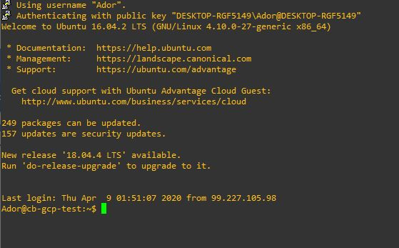

# Kubernetes

Ce laboratoire permettra de créer une grappe (cluster) Kubernetes sur GCP (Google Cloud Platform).

:closed_book: Copiez le `README.md` dans votre répertoire et cocher les sections `- [x]` au fur et à mesure de votre progression.

## :o: Sur votre PC, créer votre répertoire de travail dans `git bash`

- [✔ ] Dans le répertoire `4.Kubernetes` Créer un répertoire avec comme nom, votre :id:

`$ mkdir ` :id:

- [✔ ] Copier le fichier se trouvant dans le repretoire `.` dans votre répertoire

      * incluant le fichier `README.md` 


`$ cp ./README.md `:id:` `

- [ ✔] Soumettre votre répertoire de travail vers github `(git add, commit, push)` 

## :a: Dans votre Serveur Windows du laboratoire

## :star: Prérequis

Etapes: 

- [✔ ]  Ouvrir son compte GCP

- [✔ ]  Configurer son environnement GCP
```
C:\Program Files (x86)\Google\Cloud SDK>gcloud init
Welcome! This command will take you through the configuration of gcloud.

Settings from your current configuration [default] are:
compute:
  region: us-east1
  zone: us-east1-b
core:
  account: ordenrosae@gmail.com
  disable_usage_reporting: 'True'
  project: b300112017

Pick configuration to use:
 [1] Re-initialize this configuration [default] with new settings
 [2] Create a new configuration
Please enter your numeric choice:  1

Your current configuration has been set to: [default]

You can skip diagnostics next time by using the following flag:
  gcloud init --skip-diagnostics

Network diagnostic detects and fixes local network connection issues.
Checking network connection...done.
Reachability Check passed.
Network diagnostic passed (1/1 checks passed).

Choose the account you would like to use to perform operations for
this configuration:
 [1] ordenrosae@gmail.com
 [2] Log in with a new account
Please enter your numeric choice:  1

You are logged in as: [ordenrosae@gmail.com].

Pick cloud project to use:
 [1] ador-273700
 [2] b300112017-273623
 [3] Create a new project
Please enter numeric choice or text value (must exactly match list
item):  2

Your current project has been set to: [b300112017-273623].

Do you want to configure a default Compute Region and Zone? (Y/n)?  y

Which Google Compute Engine zone would you like to use as project
default?
If you do not specify a zone via a command line flag while working
with Compute Engine resources, the default is assumed.
 [1] us-east1-b
 [2] us-east1-c
 [3] us-east1-d
 [4] us-east4-c
 [5] us-east4-b
 [6] us-east4-a
 [7] us-central1-c
 [8] us-central1-a
 [9] us-central1-f
 [10] us-central1-b
 [11] us-west1-b
 [12] us-west1-c
 [13] us-west1-a
 [14] europe-west4-a
 [15] europe-west4-b
 [16] europe-west4-c
 [17] europe-west1-b
 [18] europe-west1-d
 [19] europe-west1-c
 [20] europe-west3-c
 [21] europe-west3-a
 [22] europe-west3-b
 [23] europe-west2-c
 [24] europe-west2-b
 [25] europe-west2-a
 [26] asia-east1-b
 [27] asia-east1-a
 [28] asia-east1-c
 [29] asia-southeast1-b
 [30] asia-southeast1-a
 [31] asia-southeast1-c
 [32] asia-northeast1-b
 [33] asia-northeast1-c
 [34] asia-northeast1-a
 [35] asia-south1-c
 [36] asia-south1-b
 [37] asia-south1-a
 [38] australia-southeast1-b
 [39] australia-southeast1-c
 [40] australia-southeast1-a
 [41] southamerica-east1-b
 [42] southamerica-east1-c
 [43] southamerica-east1-a
 [44] asia-east2-a
 [45] asia-east2-b
 [46] asia-east2-c
 [47] asia-northeast2-a
 [48] asia-northeast2-b
 [49] asia-northeast2-c
 [50] asia-northeast3-a
Did not print [18] options.
Too many options [68]. Enter "list" at prompt to print choices fully.
Please enter numeric choice or text value (must exactly match list
item):  8

Your project default Compute Engine zone has been set to [us-central1-a].
You can change it by running [gcloud config set compute/zone NAME].

Your project default Compute Engine region has been set to [us-central1].
You can change it by running [gcloud config set compute/region NAME].

Your Google Cloud SDK is configured and ready to use!

* Commands that require authentication will use ordenrosae@gmail.com by default
* Commands will reference project `b300112017-273623` by default
* Compute Engine commands will use region `us-central1` by default
* Compute Engine commands will use zone `us-central1-a` by default

Run `gcloud help config` to learn how to change individual settings

This gcloud configuration is called [default]. You can create additional configurations if you work with multiple accounts and/or projects.
Run `gcloud topic configurations` to learn more.

Some things to try next:

* Run `gcloud --help` to see the Cloud Platform services you can interact with. And run `gcloud help COMMAND` to get help on any gcloud command.
* Run `gcloud topic --help` to learn about advanced features of the SDK like arg files and output formatting
```                                                                                                                 

- [ ✔]  Créer sa première VM avec GCP

</img>

</img>


- [✔ ]  Créer son premier cluster Kubernetes avec GCP


# GCP - Google Cloud Platform

## :one: GCP Console

https://console.cloud.google.com

## :two: Configuration 

### :pushpin: Create a Service Account

https://cloud.google.com/docs/authentication/production#creating_a_service_account


## Créer son environment GCP (incluant la console)

1. In the Cloud Console, go to the Create service account key page.
    
    **Go to the Create Service Account Key page**
    
2. From the `Service account` list, select `New service account`.

3. In the Service account name field, enter a name.

4. From the `Role` list, select `Project > Owner`.

:star:
Note: The Role field authorizes your service account to access resources. 
You can view and change this field later by using the Cloud Console. 
If you are developing a production app, specify more granular permissions than `Project > Owner`. 
For more information, see [granting role` to service accounts](https://cloud.google.com/iam/docs/granting-roles-to-service-accounts).

5. Click `Create`. A JSON file that contains your key downloads to your computer.

* Le fichier téléchargé sera sauvegarder dans le répertoire `~/.gcp` Créer le répertoire au préalable.

Example: ajuster avec le nom de fichier `identifiants`

```
~/.gcp/b300112017-790eba8c76.json
```

6. Ajouter la variable d'identifiants à son` Environement`

https://cloud.google.com/docs/authentication/getting-started#setting_the_environment_variable

Example: ajuster avec le nom de fichier `identifiants`

```
% export GOOGLE_APPLICATION_CREDENTIALS="$HOME/.gcp/b300112017-273623-790eba8c76.json"
```
 
 ## Gérer son environnement avec gcloud CLI
 
 
 ## 1- Installer gcloud cli
 
 ```
 PS > choco install gcloudsdk
 ```
 
 ## Explorer gcloud CLI (Optionnel, sert uniquement à tester les commandes gcloud)
 
 ## Connection par le browser
 
 </img>
 
 ## Set le projet

```
gcloud config set project b300112017
Updated property [core/project].
```
```
gcloud beta compute ssh --zone "us-central1-a" "cb-gcp-test" --project "b300112017"
You do not currently have this command group installed.  Using it 
requires the installation of components: [beta]


Your current Cloud SDK version is: 286.0.0
Installing components from version: 286.0.0

┌─────────────────────────────────────────────┐
│     These components will be installed.     │
├──────────────────────┬────────────┬─────────┤
│         Name         │  Version   │   Size  │
├──────────────────────┼────────────┼─────────┤
│ gcloud Beta Commands │ 2019.05.17 │ < 1 MiB │
└──────────────────────┴────────────┴─────────┘

For the latest full release notes, please visit:
  https://cloud.google.com/sdk/release_notes

Do you want to continue (Y/n)?  Y

╔════════════════════════════════════════════════════════════╗
╠═ Creating update staging area                             ═╣
╠════════════════════════════════════════════════════════════╣
╠═ Installing: gcloud Beta Commands                         ═╣
╠════════════════════════════════════════════════════════════╣
╠═ Creating backup and activating new installation          ═╣
╚════════════════════════════════════════════════════════════╝

Performing post processing steps...done.                                                                                                                                      

Update done!

Restarting command:
  $ gcloud beta compute ssh --zone us-central1-a cb-gcp-test --project b300112017

ERROR: (gcloud.beta.compute.ssh) You do not currently have an active account selected.
Please run:

  $ gcloud auth login

to obtain new credentials, or if you have already logged in with a
different account:

  $ gcloud config set account ACCOUNT
  ```


## Creer sa cle SSH en se connectant a la machine

```
gcloud beta compute ssh --zone us-central1-a cb-gcp-test --project b300112017

WARNING: The public SSH key file for gcloud does not exist.
WARNING: The private SSH key file for gcloud does not exist.
WARNING: You do not have an SSH key for gcloud.
WARNING: SSH keygen will be executed to generate a key.
Generating public/private rsa key pair.
Enter passphrase (empty for no passphrase): 
Enter same passphrase again: 
Your identification has been saved in /Users/b300098957/.ssh/google_compute_engine.
Your public key has been saved in /Users/b300098957/.ssh/google_compute_engine.pub.
The key fingerprint is:
SHA256:SAjs2IsFnkjdn9KOjaimMzkEOD0SBTl8OKeuZ6sE3dg b300098957@ramena
The key's randomart image is:
+---[RSA 2048]----+
|o== .            |
|==.= o           |
|=O* . + .        |
|B=*+ o =         |
|+=ooE B S        |
|oo.. o o         |
|oo.              |
|Boo              |
|=B..             |
+----[SHA256]-----+
Updating instance ssh metadata...⠶Updated [https://www.googleapis.com/compute/beta/projects/b300098957/zones/us-central1-a/instances/cb-gcp-test].                            
Updating instance ssh metadata...done.                                                                                                                                        
Waiting for SSH key to propagate.
Warning: Permanently added 'compute.2839761481240567167' (ECDSA) to the list of known hosts.
Welcome to Ubuntu 16.04.2 LTS (GNU/Linux 4.10.0-27-generic x86_64)

 * Documentation:  https://help.ubuntu.com
 * Management:     https://landscape.canonical.com
 * Support:        https://ubuntu.com/advantage

  Get cloud support with Ubuntu Advantage Cloud Guest:
    http://www.ubuntu.com/business/services/cloud

249 packages can be updated.
157 updates are security updates.

New release '18.04.4 LTS' available.
Run 'do-release-upgrade' to upgrade to it.


Ador@cb-gcp-test:~$ 
```

</img>

## Fichier de clés SSH
```
ls -l ~/.ssh/google_compute_*
-rw-r--r-- 1 Ador 197121 1675 Apr  5 15:15 /c/Users/Ador/.ssh/google_compute_engine
-rw-r--r-- 1 Ador 197121 1454 Apr  5 15:15 /c/Users/Ador/.ssh/google_compute_engine.ppk
-rw-r--r-- 1 Ador 197121  418 Apr  5 15:15 /c/Users/Ador/.ssh/google_compute_engine.pub

```

## Créer son premier cluster Kubernetes avec GCP
```
% gcloud container clusters create kubia --num-nodes 3 --machine-type f1-micro --zone "us-central1-a"

C:\Program Files (x86)\Google\Cloud SDK>gcloud container clusters create kubia --num-nodes 3 --machine-type f1-micro --zone "us-central1-a"
WARNING: Currently VPC-native is not the default mode during cluster creation. In the future, this will become the default mode and can be disabled using `--no-enable-ip-alias` flag. Use `--[no-]enable-ip-alias` flag to suppress this warning.
WARNING: Newly created clusters and node-pools will have node auto-upgrade enabled by default. This can be disabled using the `--no-enable-autoupgrade` flag.
WARNING: Starting with version 1.18, clusters will have shielded GKE nodes by default.
WARNING: Your Pod address range (`--cluster-ipv4-cidr`) can accommodate at most 1008 node(s).
This will enable the autorepair feature for nodes. Please see https://cloud.google.com/kubernetes-engine/docs/node-auto-repair for more information on node autorepairs.
Creating cluster kubia in us-central1-a... Cluster is being health-checked (master is healthy)...done.
Created [https://container.googleapis.com/v1/projects/b300112017-273623/zones/us-central1-a/clusters/kubia].
To inspect the contents of your cluster, go to: https://console.cloud.google.com/kubernetes/workload_/gcloud/us-central1-a/kubia?project=b300112017-273623
kubeconfig entry generated for kubia.
NAME   LOCATION       MASTER_VERSION  MASTER_IP       MACHINE_TYPE  NODE_VERSION    NUM_NODES  STATUS
kubia  us-central1-a  1.14.10-gke.27  104.198.71.194  f1-micro      1.14.10-gke.27  3          RUNNING
```

</img>
```
% gcloud projects list
PROJECT_ID         NAME        PROJECT_NUMBER
b300112017-273623  b300112017  519722586733
```
# Vérifier que l'on a 3 noeuds (nodes) 
## _Note:un noeud est égale une machine virtuelle (VM)_
```
% kubectl get nodes
NAME                                   STATUS     ROLES    AGE   VERSION
gke-kubia-default-pool-e6fd6670-1zcv   NotReady   <none>   14m   v1.14.10-gke.27
gke-kubia-default-pool-e6fd6670-8jzb   NotReady   <none>   14m   v1.14.10-gke.27
gke-kubia-default-pool-e6fd6670-qls8   NotReady   <none>   14m   v1.14.10-gke.27
```

</img>

## Décrire un des noeuds avec la commande describe

```
% kubectl describe node gke-kubia-default-pool-e6fd6670-8jzb
C:\Program Files (x86)\Google\Cloud SDK>kubectl describe node gke-kubia-default-pool-e6fd6670-8jzb
Name:               gke-kubia-default-pool-e6fd6670-8jzb
Roles:              <none>
Labels:             beta.kubernetes.io/arch=amd64
                    beta.kubernetes.io/fluentd-ds-ready=true
                    beta.kubernetes.io/instance-type=f1-micro
                    beta.kubernetes.io/os=linux
                    cloud.google.com/gke-nodepool=default-pool
                    cloud.google.com/gke-os-distribution=cos
                    failure-domain.beta.kubernetes.io/region=us-central1
                    failure-domain.beta.kubernetes.io/zone=us-central1-a
                    kubernetes.io/arch=amd64
                    kubernetes.io/hostname=gke-kubia-default-pool-e6fd6670-8jzb
                    kubernetes.io/os=linux
Annotations:        container.googleapis.com/instance_id: 1704390514379523766
                    node.alpha.kubernetes.io/ttl: 0
                    volumes.kubernetes.io/controller-managed-attach-detach: true
CreationTimestamp:  Thu, 09 Apr 2020 01:55:23 -0400
Taints:             node.kubernetes.io/unreachable:NoSchedule
Unschedulable:      false
Conditions:
  Type                          Status    LastHeartbeatTime                 LastTransitionTime                Reason                          Message
  ----                          ------    -----------------                 ------------------                ------                          -------
  FrequentDockerRestart         True      Thu, 09 Apr 2020 02:18:55 -0400   Thu, 09 Apr 2020 02:12:22 -0400   FrequentDockerRestart           Found 5 matching logs, which meets the threshold of 5
  FrequentContainerdRestart     False     Thu, 09 Apr 2020 02:18:55 -0400   Thu, 09 Apr 2020 02:12:24 -0400   NoFrequentContainerdRestart     containerd is functioning properly
  KernelDeadlock                False     Thu, 09 Apr 2020 02:18:55 -0400   Thu, 09 Apr 2020 01:55:28 -0400   KernelHasNoDeadlock             kernel has no deadlock
  ReadonlyFilesystem            False     Thu, 09 Apr 2020 02:18:55 -0400   Thu, 09 Apr 2020 01:55:28 -0400   FilesystemIsNotReadOnly         Filesystem is not read-only
  CorruptDockerOverlay2         False     Thu, 09 Apr 2020 02:18:55 -0400   Thu, 09 Apr 2020 01:55:28 -0400   NoCorruptDockerOverlay2         docker overlay2 is functioning properly
  FrequentUnregisterNetDevice   False     Thu, 09 Apr 2020 02:18:55 -0400   Thu, 09 Apr 2020 02:15:33 -0400   NoFrequentUnregisterNetDevice   node is functioning properly
  FrequentKubeletRestart        True      Thu, 09 Apr 2020 02:18:55 -0400   Thu, 09 Apr 2020 02:15:34 -0400   FrequentKubeletRestart          Found 5 matching logs, which meets the threshold of 5
  NetworkUnavailable            False     Thu, 09 Apr 2020 01:55:31 -0400   Thu, 09 Apr 2020 01:55:31 -0400   RouteCreated                    RouteController created a route
  MemoryPressure                Unknown   Thu, 09 Apr 2020 02:16:24 -0400   Thu, 09 Apr 2020 02:17:43 -0400   NodeStatusUnknown               Kubelet stopped posting node status.
  DiskPressure                  Unknown   Thu, 09 Apr 2020 02:16:24 -0400   Thu, 09 Apr 2020 02:17:43 -0400   NodeStatusUnknown               Kubelet stopped posting node status.
  PIDPressure                   Unknown   Thu, 09 Apr 2020 02:16:24 -0400   Thu, 09 Apr 2020 02:17:43 -0400   NodeStatusUnknown               Kubelet stopped posting node status.
  Ready                         Unknown   Thu, 09 Apr 2020 02:16:24 -0400   Thu, 09 Apr 2020 02:17:43 -0400   NodeStatusUnknown               Kubelet stopped posting node status.
Addresses:
  InternalIP:   10.128.0.4
  ExternalIP:   34.66.179.46
  InternalDNS:  gke-kubia-default-pool-e6fd6670-8jzb.us-central1-a.c.b300112017-273623.internal
  Hostname:     gke-kubia-default-pool-e6fd6670-8jzb.us-central1-a.c.b300112017-273623.internal
Capacity:
 attachable-volumes-gce-pd:  15
 cpu:                        1
 ephemeral-storage:          98868448Ki
 hugepages-2Mi:              0
 memory:                     600420Ki
 pods:                       110
Allocatable:
 attachable-volumes-gce-pd:  15
 cpu:                        940m
 ephemeral-storage:          98868448Ki
 hugepages-2Mi:              0
 memory:                     236900Ki
 pods:                       110
System Info:
 Machine ID:                 44aae4becacc4747bba5601b83c54b99
 System UUID:                44AAE4BE-CACC-4747-BBA5-601B83C54B99
 Boot ID:                    4ade95a0-bd59-483c-8bcb-231146035e4a
 Kernel Version:             4.14.138+
 OS Image:                   Container-Optimized OS from Google
 Operating System:           linux
 Architecture:               amd64
 Container Runtime Version:  docker://18.9.7
 Kubelet Version:            v1.14.10-gke.27
 Kube-Proxy Version:         v1.14.10-gke.27
PodCIDR:                     10.52.2.0/24
ProviderID:                  gce://b300112017-273623/us-central1-a/gke-kubia-default-pool-e6fd6670-8jzb
Non-terminated Pods:         (4 in total)
  Namespace                  Name                                               CPU Requests  CPU Limits  Memory Requests  Memory Limits  AGE
  ---------                  ----                                               ------------  ----------  ---------------  -------------  ---
  kube-system                fluentd-gcp-v3.1.1-lkpmt                           0 (0%)        0 (0%)      0 (0%)           0 (0%)         25m
  kube-system                kube-dns-5877696fb4-vmgj6                          260m (27%)    0 (0%)      110Mi (47%)      170Mi (73%)    25m
  kube-system                kube-proxy-gke-kubia-default-pool-e6fd6670-8jzb    100m (10%)    0 (0%)      0 (0%)           0 (0%)         25m
  kube-system                prometheus-to-sd-r6jd6                             1m (0%)       3m (0%)     20Mi (8%)        20Mi (8%)      25m
Allocated resources:
  (Total limits may be over 100 percent, i.e., overcommitted.)
  Resource                   Requests     Limits
  --------                   --------     ------
  cpu                        361m (38%)   3m (0%)
  memory                     130Mi (56%)  190Mi (82%)
  ephemeral-storage          0 (0%)       0 (0%)
  attachable-volumes-gce-pd  0            0
Events:
  Type     Reason                         Age                    From                                                   Message
  ----     ------                         ----                   ----                                                   -------
  ```
  
  ## Delete a cluster
  ```
  gcloud container clusters delete kubia --zone "us-central1-a"
```


