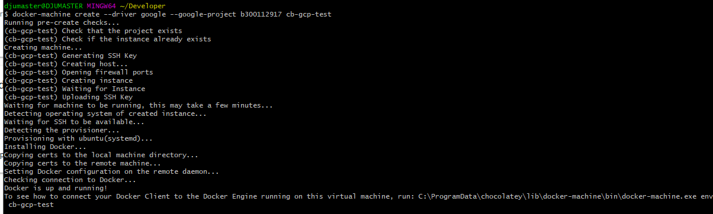

# Kubernetes

Ce laboratoire permettra de créer une grappe (cluster) Kubernetes sur GCP (Google Cloud Platform).

:closed_book: Copiez le `README.md` dans votre répertoire et cocher les sections `- [x]` au fur et à mesure de votre progression.

## :o: Sur votre PC, créer votre répertoire de travail dans `git bash`

- [X] Dans le répertoire `4.Kubernetes` Créer un répertoire avec comme nom, votre :id:

`$ mkdir ` 300112917

- [X] Copier le fichier se trouvant dans le repretoire `.` dans votre répertoire

      * incluant le fichier `README.md` 


`$ cp ./README.md `300112917` `

- [X] Soumettre votre répertoire de travail vers github `(git add, commit, push)` 

## :a: Dans votre Serveur Windows du laboratoire

## :star: Prérequis

Etapes: 

- [X]  Ouvrir son compte GCP

- [X]  Configurer son environnement GCP

```
C:\Program Files (x86)\Google\Cloud SDK>gcloud init
Welcome! This command will take you through the configuration of gcloud.

Settings from your current configuration [default] are:
accessibility:
  screen_reader: 'true'
compute:
  region: us-central1
  zone: us-central1-a
core:
  account: djmheri@gmail.com
  disable_usage_reporting: 'True'
  project: rational-autumn-272916

Pick configuration to use:
 [1] Re-initialize this configuration [default] with new settings
 [2] Create a new configuration
Please enter your numeric choice:  1

Your current configuration has been set to: [default]

You can skip diagnostics next time by using the following flag:
  gcloud init --skip-diagnostics

Network diagnostic detects and fixes local network connection issues.
Checking network connection...done.
Reachability Check passed.
Network diagnostic passed (1/1 checks passed).

Choose the account you would like to use to perform operations for
this configuration:
 [1] djmheri@gmail.com
 [2] Log in with a new account
Please enter your numeric choice:  1

You are logged in as: [etiennetochgaly@gmail.com].

Pick cloud project to use:
 [1] b300112917
 [2] Create a new project
Please enter numeric choice or text value (must exactly match list
item):  1

Your current project has been set to: [b300112917].

Do you want to configure a default Compute Region and Zone? (Y/n)?  Y

Which Google Compute Engine zone would you like to use as project
default?
If you do not specify a zone via a command line flag while working
with Compute Engine resources, the default is assumed.
 [1] us-east1-b
 [2] us-east1-c
 [3] us-east1-d
 [4] us-east4-c
 [5] us-east4-b
 [6] us-east4-a
 [7] us-central1-c
 [8] us-central1-a
 [9] us-central1-f
 [10] us-central1-b
Did not print [58] options.
Too many options [68]. Enter "list" at prompt to print choices fully.
Please enter numeric choice or text value (must exactly match list
item):  us-central1-a

Your project default Compute Engine zone has been set to [us-central1-a].
You can change it by running [gcloud config set compute/zone NAME].

Your project default Compute Engine region has been set to [us-central1].
You can change it by running [gcloud config set compute/region NAME].

Your Google Cloud SDK is configured and ready to use!

* Commands that require authentication will use djmheri@gmail.com by default
* Commands will reference project `b300112917` by default
* Compute Engine commands will use region `us-central1` by default
* Compute Engine commands will use zone `us-central1-a` by default

Run `gcloud help config` to learn how to change individual settings

This gcloud configuration is called [default]. You can create additional configurations if you work with multiple accounts and/or projects.
Run `gcloud topic configurations` to learn more.

Some things to try next:

* Run `gcloud --help` to see the Cloud Platform services you can interact with. And run `gcloud help COMMAND` to get help on any gcloud command.
* Run `gcloud topic --help` to learn about advanced features of the SDK like arg files and output formatting
```

- [X]  Créer sa première VM avec GCP

</img>

- [X]  Créer son premier cluster Kubernetes avec GCP

https://github.com/CollegeBoreal/Tutoriels/tree/master/2.Virtualisation/4.Cloud/2.Public/4.GCP

## References

https://kube.academy/

| Titre | Description |
|-------|-------------|
| [Docker In Action](https://www.manning.com/books/docker-in-action-second-edition) | [Chapitre 1](https://livebook.manning.com/book/kubernetes-in-action/chapter-1) |


