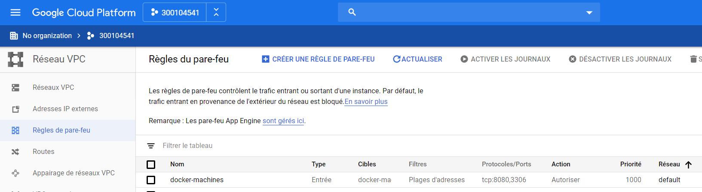
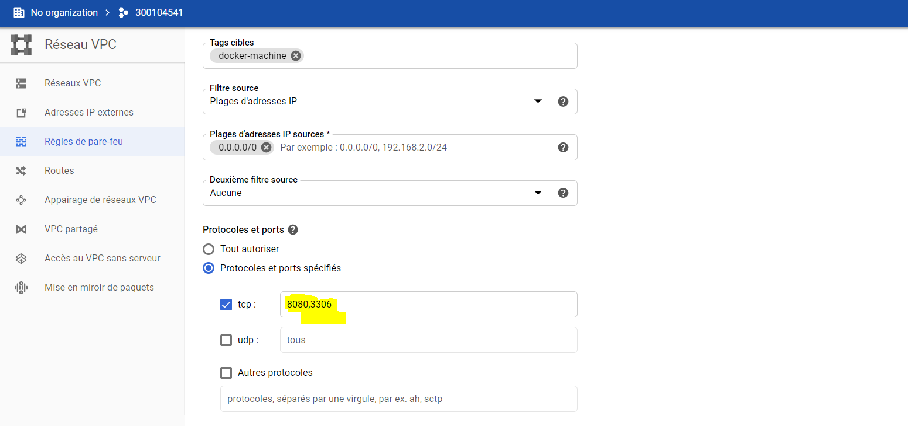

# Conteneurs
# :five: Conteneurs

Ce laboratoire permettra de créer une machine virtuelle sur un cloud public [GCP, Azure]

:closed_book: Copiez le `README.md` dans votre répertoire et cocher les sections `- [x]` au fur et à mesure de votre progression.

## :o: Sur votre PC, créer votre répertoire de travail dans `git bash`

- [x] Dans le répertoire `5.Conteneurs` Créer un répertoire avec comme nom, votre :id:

`$ mkdir ` :id:

- [x] Copier le fichier se trouvant dans le repretoire `.` dans votre répertoire

      * incluant le fichier `README.md` 


`$ cp ./README.md `:id:` `

- [ x] Soumettre votre répertoire de travail vers github `(git add, commit, push)` 

## :a: Créer une machine virtuelle dans le cloud

- [x ] Vérifier que vos identifiants `cloud` sont installés

| Cloud  |  Google  | Azure       | AWS      |  Autres |
|--------|----------|-------------|----------|---------|
| Config | `~/.gcp` | `~/.azure`  | `~/.aws` |  ...    |

- [ x] Créer une machine virtuelle avec docker machine

```
$ docker-machine create --driver google --google-project focal-set-273615 cb-romeo
```
```
- Pour activer la machine :

```
$ eval $(docker-machine env cb-romeo)
```
```
$ docker-machine active
cb-romeo
```

## :b: Créer une application de votre choix (docker ou docker compose)

- [x] Copie du fichier de configuration (i.e. Dockerfile, docker-compose.yml)

- [x] La commande `docker`, `docker-compose` utilisée pour lancer l'application

- Installer WordPress

```
$ docker-compose up --detach
The DB_NAME variable is not set. Defaulting to a blank string.
The DB_ROOT_PASSWORD variable is not set. Defaulting to a blank string.
Creating network "5conteneurs_default" with the default driver
Creating volume "5conteneurs_db_data" with default driver
Pulling db (mysql:latest)...
latest: Pulling from library/mysql
Digest: sha256:b69d0b62d02ee1eba8c7aeb32eba1bb678b6cfa4ccfb211a5d7931c7755dc4a8
Status: Downloaded newer image for mysql:latest
Pulling pma (phpmyadmin/phpmyadmin:)...
latest: Pulling from phpmyadmin/phpmyadmin
Digest: sha256:59912efb52a5b0342b3defc890a7041ab2a32dc2f5c9a014150006db8c55a793
Status: Downloaded newer image for phpmyadmin/phpmyadmin:latest
Pulling wp (wordpress:latest)...
latest: Pulling from library/wordpress
Digest: sha256:191d5caf4ef5b8c57721ade777820f3267654325f7902b2ccd377ceeba1c3fe2
Status: Downloaded newer image for wordpress:latest
Pulling wpcli (wordpress:cli)...
cli: Pulling from library/wordpress
Digest: sha256:9f165c3679042257f7c7905b0cb9491b1d3e37d78590f2b52235a968212c3f71
Status: Downloaded newer image for wordpress:cli
Creating 5conteneurs_db_1 ... done
Creating 5conteneurs_pma_1 ... done
Creating 5conteneurs_wp_1  ... done
Creating 5conteneurs_wpcli_1 ... done

```
- Initialiser WordPress

📌 Administrer le site Wordpress
```
http://104.198.19.69/wp-admin/
```

📌 Visualiser MySQL avec PHPMyAdmin

```
http://104.198.19.69:8080

## :ab: Vérifier que l'application marche

:bulb: Faites attention au `firewall` de chaque nuage. Chaque nuage a sa propre configuration

- [x] Décrire la configuration du `firewall`

### *Selectionez la mahine vertuelle puis cliquer sur Afficher les details du réseaux


### *Cliquez sur Regles de pare-feu et choisissez la 1er regle sous le nom de docker-machine puis cliquer sur Modifier 



### *Pour Protocoles et ports, choisissez Protocoles et ports spécifiés et saisissez tcp: 8080,3306 dans le champ associé, où :

- 8080 est le port utilisé par WordPress.
- 3306 est le port utilisé par phpMyAdmin.




## :o: Décriver votre application et donner les accés pour la vérification 
 

- [x] Que fait l'application?

```
Un site web WordPress sous nom de "Tech Tutoriels", Mon 1er tutoreil sera sur les étapes à suivre pour installer et configurer Samba sur Ubuntu
```

- [x] Quel est son adresse IP?

```
34.67.12.74
```

- [x] Quel port utilisé pour y accéder?

```
Port tcp 8080 
```

## :star: Autres commentaires utiles à donner

- [X] Commentaires

[Participation](Participation.md)

# Références

https://github.com/CollegeBoreal/Tutoriels/tree/master/2.Virtualisation/2.VM/1.Docker

