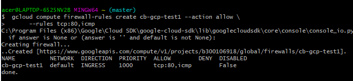
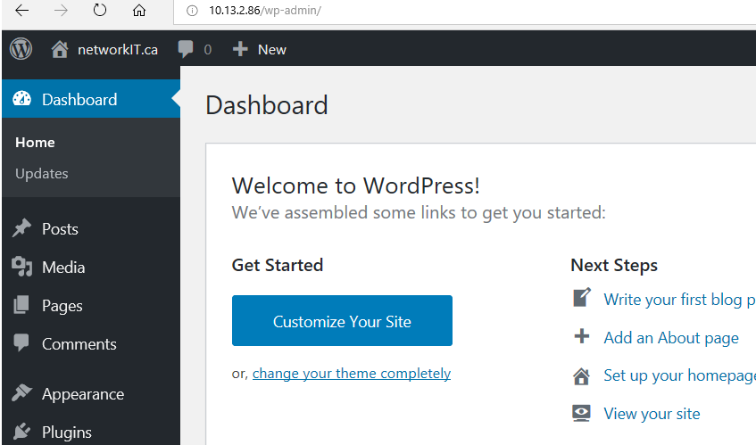

# :five: Conteneurs

Ce laboratoire permettra de créer une machine virtuelle sur un cloud public [GCP, Azure]

:closed_book: Copiez le `README.md` dans votre répertoire et cocher les sections `- [x]` au fur et à mesure de votre progression.

## :o: Sur votre PC, créer votre répertoire de travail dans `git bash`

- [x ] Dans le répertoire `5.Conteneurs` Créer un répertoire avec comme nom, votre :id:

`$ mkdir ` :id:

- [x ] Copier le fichier se trouvant dans le repretoire `.` dans votre répertoire

      * incluant le fichier `README.md` 


`$ cp ./README.md `:id:` `

- [x] Soumettre votre répertoire de travail vers github `(git add, commit, push)` 

## :a: Créer une machine virtuelle dans le cloud

- [ ] Vérifier que vos identifiants `cloud` sont installés

| Cloud  |  Google  | Azure       | AWS      |  Autres |
|--------|----------|-------------|----------|---------|
| Config | `~/.gcp` | `~/.azure`  | `~/.aws` |  ...    |

- [X] Créer une machine virtuelle avec docker machine

```
$ docker-machine --driver <un driver cloud> <option> ma-machine-virtuelle
```

## :b: Créer une application de votre choix (docker ou docker compose)

- [x] Copie du fichier de configuration (i.e. Dockerfile, docker-compose.yml)

- [x] La commande `docker`, `docker-compose` utilisée pour lancer l'application

## :ab: Vérifier que l'application marche

:bulb: Faites attention au `firewall` de chaque nuage. Chaque nuage a sa propre configuration

- [x] Décrire la configuration du `firewall`

'''
             :bulb: https://cloud.google.com/sdk/gcloud/reference/compute/firewall-rules/create
              
               $ gcloud compute firewall-rules create MY-RULE --allow tcp:80,icmp
             
                  gcloud compute firewall-rules create cb-gcp-test1 --action allow \
                                                                    --rules tcp:80,icpm
                               
 '''
 

## :o: Décriver votre application et donner les accés pour la vérification 

- [x] Que fait l'application?
              
- [x] Quel est son adresse IP?
 '''                   
            http://34.66.40.184/wp-admin/ 
 '''
 
  

- [x] Quel port utilisé pour y accéder?

## :star: Autres commentaires utiles à donner

- [X] Commentaires 

https://cloud.google.com/compute/docs/reference/rest/v1/firewalls
https://www.terraform.io/docs/providers/google/r/compute_firewall.html


'''
        To get more information about Firewall, see: API
                    resource "google_compute_firewall" "default" {
  name    = "test-firewall"
  network = google_compute_network.default.name

  allow {
    protocol = "icmp"
  }

  allow {
    protocol = "tcp"
    ports    = ["80", "8080", "1000-2000"]
  }

  source_tags = ["web"]
}

resource "google_compute_network" "default" {
  name = "test-network"
}

''''

[Participation](Participation.md)

# Références

https://github.com/CollegeBoreal/Tutoriels/tree/master/2.Virtualisation/2.VM/1.Docker
