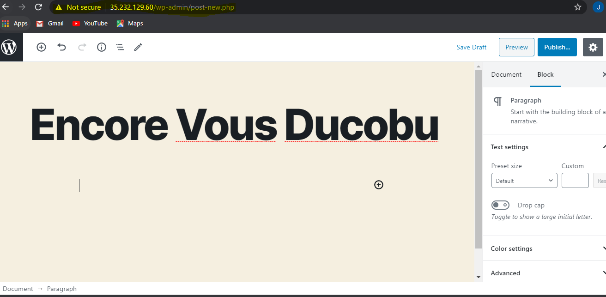
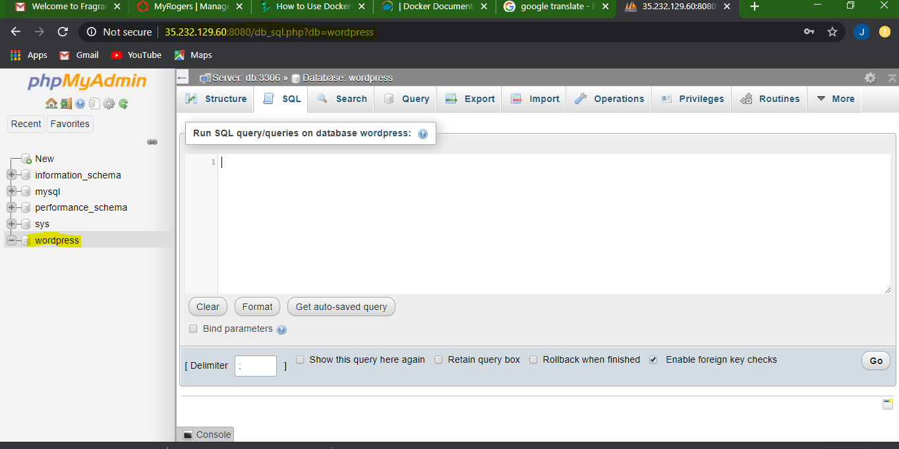
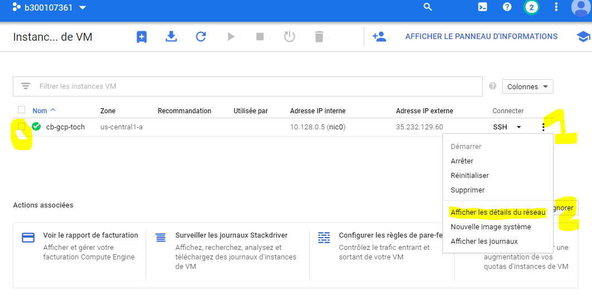
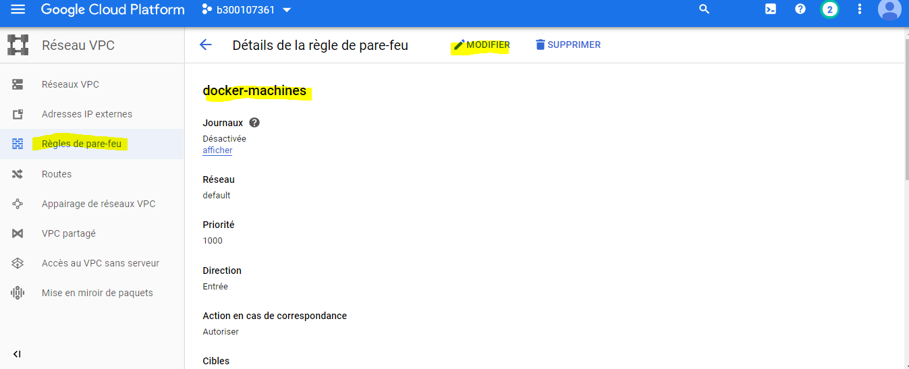
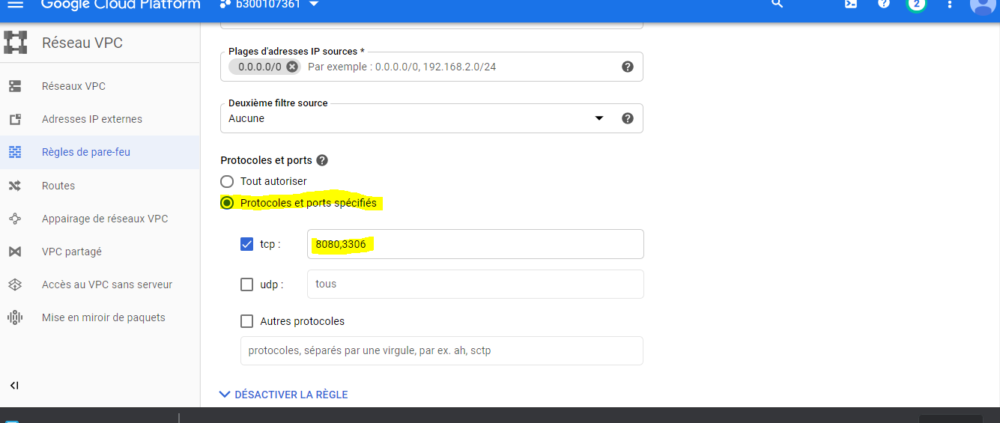
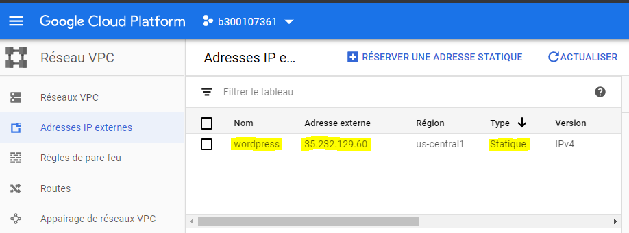

# :five: Conteneurs

Ce laboratoire permettra de créer une machine virtuelle sur Google Cloud

:closed_book: Copiez le `README.md` dans votre répertoire et cocher les sections `- [x]` au fur et à mesure de votre progression.

## :o: Sur votre PC, créer votre répertoire de travail dans `git bash`

- [x] Dans le répertoire `5.Conteneurs` Créer un répertoire avec comme nom, votre :id:

`$ mkdir ` :id:

- [x] Copier le fichier se trouvant dans le repretoire `.` dans votre répertoire

      * incluant le fichier `README.md` 


`$ cp ./README.md `:id:` `

- [x] Soumettre votre répertoire de travail vers github `(git add, commit, push)` 

## :a: Créer une machine virtuelle dans le cloud

- [x] Vérifier que vos identifiants `cloud` sont installés

```
$ echo $GOOGLE_APPLICATION_CREDENTIALS
/c/Users/Tochgaly-K.J.Etienne/.gcp/b300107361-274400-c449e4bb3ffd.json
```
- Ajouter la variable d'identifiants à son Environement

```
$ export GOOGLE_APPLICATION_CREDENTIALS="$HOME/.gcp/b300108234-de32988388af.json"
```

| Cloud  |  Google  | Azure       | AWS      |  Autres |
|--------|----------|-------------|----------|---------|
| Config | `~/.gcp` | `~/.azure`  | `~/.aws` |  ...    |

- [x] Créer une machine virtuelle avec docker machine

```
PS C:\Users\Tochgaly-K.J.Etienne> docker-machine create --driver google --google-project b300107361-274400 cb-gcp-toch
Running pre-create checks...
(cb-gcp-toch) Check that the project exists
(cb-gcp-toch) Check if the instance already exists
Creating machine...
(cb-gcp-toch) Generating SSH Key
(cb-gcp-toch) Creating host...
(cb-gcp-toch) Opening firewall ports
(cb-gcp-toch) Creating instance
(cb-gcp-toch) Waiting for Instance
(cb-gcp-toch) Uploading SSH Key
Waiting for machine to be running, this may take a few minutes...
Detecting operating system of created instance...
Waiting for SSH to be available...
Detecting the provisioner...
Provisioning with ubuntu(systemd)...
Installing Docker...
Copying certs to the local machine directory...
Copying certs to the remote machine...
Setting Docker configuration on the remote daemon...
Checking connection to Docker...
Docker is up and running!
To see how to connect your Docker Client to the Docker Engine running on this virtual machine, run: C:\ProgramData\chocolatey\lib\docker-machine\bin\docker-machine.exe env cb-gcp-toch
```
- Pour activer la machine :

📌 Sur `GitBash`
```
$ eval $(docker-machine env cb-gcb-toch)
```
```
$ docker-machine active
cb-gcp-toch
```

📌 Sous `Powershell`
```
PS C:\Users\Tochgaly-K.J.Etienne> docker-machine env cb-gcp-toch | Invoke-Expression
```
```
PS C:\Users\Tochgaly-K.J.Etienne> docker-machine active
cb-gcp-toch
```

## :b: Créer une application de votre choix (docker ou docker compose)

- [x] Copie du fichier de configuration (i.e. Dockerfile, docker-compose.yml)

- [x] La commande `docker`, `docker-compose` utilisée pour lancer l'application

- Installer WordPress

```
PS C:\Users\Tochgaly-K.J.Etienne> docker-compose up --detach
Creating network "tochgaly-kjetienne_default" with the default driver
Creating volume "tochgaly-kjetienne_db_data" with default driver
Pulling db (mysql:latest)...
latest: Pulling from library/mysql
123275d6e508: Pulling fs layer
27cddf5c7140: Pulling fs layer
27cddf5c7140: Downloading [============>                                      ]     425B/1.737123275d6e508: Downloading [>                                                  ]  277.6kB/27.1M123275d6e508: Downloading [==================>                                ]  10.07MB/27.1M123275d6e508: Extracting [>                                                  ]  294.9kB/27.1MB123275d6e508: Extracting [====>                                              ]  2.359MB/27.1MB123275d6e508: Extracting [=======>                                           ]  4.129MB/27.1MBcd74fd7796ae: Waiting
123275d6e508: Extracting [============>                                      ]  6.783MB/27.1MB123275d6e508: Extracting [================>                                  ]  8.847MB/27.1MB123275d6e508: Extracting [===================>                               ]  10.62MB/27.1MB123275d6e508: Extracting [=======================>                           ]  12.68MB/27.1MB
123275d6e508: Extracting [===========================>                       ]  14.75MB/27.1MB123275d6e508: Extracting [==============================>                    ]  16.52MB/27.1MB123275d6e508: Extracting [=================================>                 ]  18.28MB/27.1MBMB
123275d6e508: Extracting [======================================>            ]  20.64MB/27.1MB123275d6e508: Extracting [==========================================>        ]     23MB/27.1MB123275d6e508: Extracting [=============================================>     ]  24.77MB/27.1MB123275d6e508: Extracting [===============================================>   ]  25.66MB/27.1MB123275d6e508: Extracting [===============================================>   ]  25.95MB/27.1MB
...
55e4982edb2a: Pull complete
d05a07380255: Pull complete
Digest: sha256:c265750c9a5e1333fdc44e23434c8a2a7a12fb758e0ef8b4a7e80ba1ed80ea2b
Status: Downloaded newer image for wordpress:cli
Creating tochgaly-kjetienne_db_1 ... done
Creating tochgaly-kjetienne_wp_1  ... done
Creating tochgaly-kjetienne_pma_1   ... done
Creating tochgaly-kjetienne_wpcli_1 ... done
```


- Initialiser WordPress

📌 Administrer le site Wordpress

http://35.232.129.60/wp-admin

📌 Visualiser MySQL avec PHPMyAdmin

http://35.232.129.60:8080


## :ab: Vérifier que l'application marche

:bulb: Faites attention au `firewall` de chaque nuage. Chaque nuage a sa propre configuration

- [x] Décrire la configuration du `firewall`

- étape à suivre:

### *Selectionez la mahine vertuelle puis cliquer sur Afficher les details du réseaux



### *Cliquez sur Regles de pare-feu et choisissez la 1er regle sous le nom de docker-machine puis cliquer sur Modifier 



### *Pour Protocoles et ports, choisissez Protocoles et ports spécifiés et saisissez tcp: 8080,3306 dans le champ associé, où :

- 8080 est le port utilisé par WordPress.
- 3306 est le port utilisé par phpMyAdmin.




## :o: Décriver votre application et donner les accés pour la vérification 

- [x] Que fait l'application?

* L'application permet de personnaliser un site WordPress 
* WordPress est un outil de blogage gratuit et open source et un système de gestion de contenu (CMS) basé sur PHP et MySQL, qui fonctionne sur un service d'hébergement Web. 
* Les fonctionnalités incluent une architecture de plugin et un système de modèles. WordPress est utilisé par plus de 22,0% des 10 millions de principaux sites Web en août 2013. 
* WordPress est le système de blogage le plus populaire utilisé sur le Web, avec plus de 60 millions de sites Web. Les langues les plus utilisées sont l'anglais, l'espagnol et le bahasa indonesia.

- [x] Quel est son adresse IP?

```
35.232.129.60
```
📌 L'addresse est `ephemere` par defaut, pour un serveur Wordpress qui sera accessible depuis un serveur il serait plus efficace de promottre cette addresse `statique` de preference
 

- [x] Quel port utilisé pour y accéder?

```
Port tcp 8080 
```

## :star: Autres commentaires utiles à donner

- [x] Commentaires

*A faire 

# Références

https://github.com/CollegeBoreal/Tutoriels/tree/master/2.Virtualisation/2.VM/1.Docker
