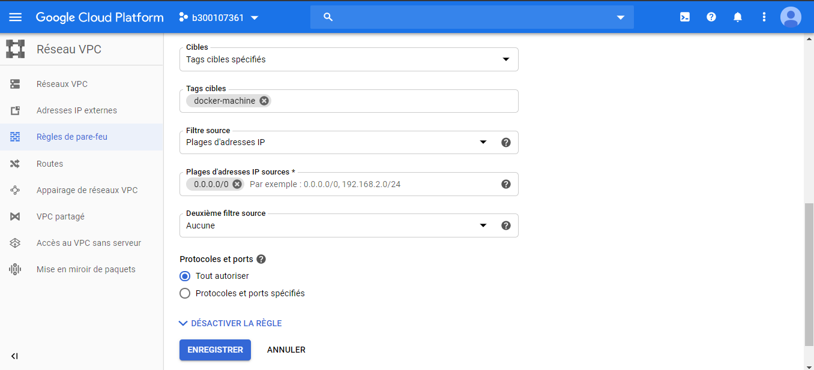
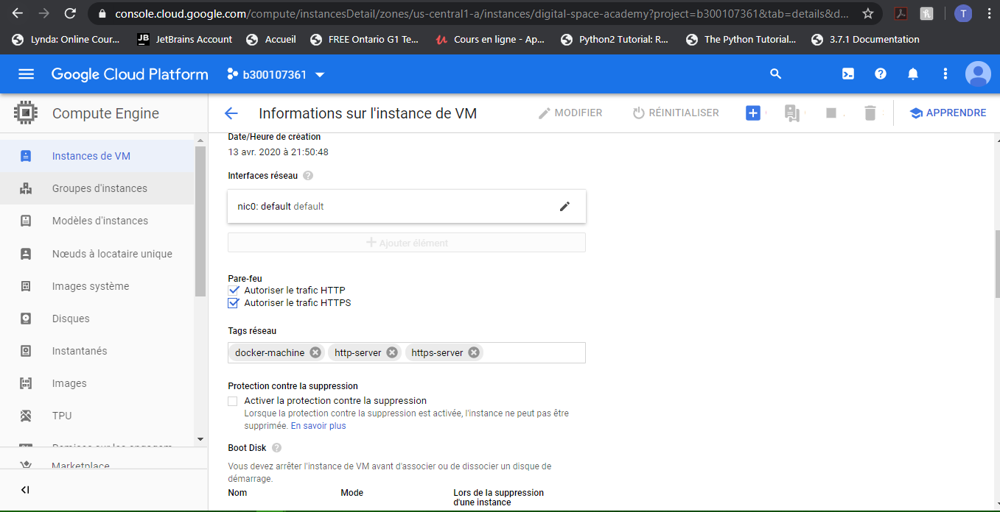

# :five: Conteneurs

Ce laboratoire permettra de créer une machine virtuelle sur un cloud public [GCP, Azure]

:closed_book: Copiez le `README.md` dans votre répertoire et cocher les sections `- [x]` au fur et à mesure de votre progression.

## :o: Sur votre PC, créer votre répertoire de travail dans `git bash`

- [x] Dans le répertoire `5.Conteneurs` Créer un répertoire avec comme 
nom, votre :id:

`$ mkdir ` :id:

- [x] Copier le fichier se trouvant dans le repretoire `.` dans votre 
répertoire

      * incluant le fichier `README.md` 


`$ cp ./README.md `:id:` `

- [x] Soumettre votre répertoire de travail vers github `(git add, commit, 
push)` 

## :a: Créer une machine virtuelle dans le cloud

- [x] Vérifier que vos identifiants `cloud` sont installés

| Cloud  |  Google  | Azure       | AWS      |  Autres |
|--------|----------|-------------|----------|---------|
| Config | `~/.gcp` | `~/.azure`  | `~/.aws` |  ...    |

- [x] Créer une machine virtuelle avec docker machine

```
$ docker-machine create --driver google --google-project b300107361 digital-space-academy
Running pre-create checks...
(digital-space-academy) Check that the project exists
(digital-space-academy) Check if the instance already exists
Creating machine...
(digital-space-academy) Generating SSH Key
(digital-space-academy) Creating host...
(digital-space-academy) Opening firewall ports
(digital-space-academy) Creating instance
(digital-space-academy) Waiting for Instance
(digital-space-academy) Uploading SSH Key
Waiting for machine to be running, this may take a few minutes...
Detecting operating system of created instance...
Waiting for SSH to be available...
Detecting the provisioner...
Provisioning with ubuntu(systemd)...
Installing Docker...
Copying certs to the local machine directory...
Copying certs to the remote machine...
Setting Docker configuration on the remote daemon...
Checking connection to Docker...
Docker is up and running!
To see how to connect your Docker Client to the Docker Engine running on 
this virtual machine, run: 
C:\ProgramData\chocolatey\lib\docker-machine\bin\docker-machine.exe env 
digital-space-academy
```

```
$ docker-machine ls
NAME                    ACTIVE   DRIVER    STATE     URL                  SWARM   DOCKER     ERRORS
cb-gcp-test             -        google    Running  tcp://35.184.160.136:2376     v19.03.8
digital-space-academy   -        google    Running  tcp://34.69.50.60:2376        v19.03.8
labo16                           generic   Timeout
```

## :b: Créer une application de votre choix (docker ou docker compose)

- [x] Copie du fichier de configuration (i.e. Dockerfile, docker-compose.yml)

- [x] La commande `docker`, `docker-compose` utilisée pour lancer l'application
```
Tochgaly-K.J.Etienne@LAPTOP-1Q5O20OP MINGW64 ~
$ eval $(docker-machine env digital-space-academy)

Tochgaly-K.J.Etienne@LAPTOP-1Q5O20OP MINGW64 ~
$ docker-machine active
digital-space-academy

Tochgaly-K.J.Etienne@LAPTOP-1Q5O20OP MINGW64 ~
$ docker-machine ls
NAME                    ACTIVE   DRIVER    STATE     URL                         SWARM   DOCKER     ERRORS
cb-gcp-test             -        google    Running   tcp://35.184.160.136:2376           v19.03.8
digital-space-academy   *        google    Running   tcp://34.69.50.60:2376              v19.03.8
labo16                           generic   Timeout
```

```
Tochgaly-K.J.Etienne@LAPTOP-1Q5O20OP MINGW64 ~
$ docker run docker/whalesay cowsay joker
Unable to find image 'docker/whalesay:latest' locally
latest: Pulling from docker/whalesay
Image docker.io/docker/whalesay:latest uses outdated schema1 manifest format. Please upgrade to a schema2 image for better future compatibility. More information at https://docs.docker.com/registry/spec/deprecated-schema-v1/
e190868d63f8: Pulling fs layer
909cd34c6fd7: Pulling fs layer
0b9bfabab7c1: Pulling fs layer
a3ed95caeb02: Pulling fs layer
00bf65475aba: Pulling fs layer
c57b6bcc83e3: Pulling fs layer
8978f6879e2f: Pulling fs layer
8eed3712d2cf: Pulling fs layer
a3ed95caeb02: Waiting
00bf65475aba: Waiting
c57b6bcc83e3: Waiting
8978f6879e2f: Waiting
8eed3712d2cf: Waiting
0b9bfabab7c1: Verifying Checksum
0b9bfabab7c1: Download complete
909cd34c6fd7: Verifying Checksum
909cd34c6fd7: Download complete
a3ed95caeb02: Verifying Checksum
a3ed95caeb02: Download complete
c57b6bcc83e3: Verifying Checksum
c57b6bcc83e3: Download complete
00bf65475aba: Verifying Checksum
00bf65475aba: Download complete
e190868d63f8: Verifying Checksum
e190868d63f8: Download complete
8978f6879e2f: Verifying Checksum
8978f6879e2f: Download complete
8eed3712d2cf: Verifying Checksum
8eed3712d2cf: Download complete
e190868d63f8: Pull complete
909cd34c6fd7: Pull complete
0b9bfabab7c1: Pull complete
a3ed95caeb02: Pull complete
00bf65475aba: Pull complete
c57b6bcc83e3: Pull complete
8978f6879e2f: Pull complete
8eed3712d2cf: Pull complete
Digest: sha256:178598e51a26abbc958b8a2e48825c90bc22e641de3d31e18aaf55f3258ba93b
Status: Downloaded newer image for docker/whalesay:latest
 _______
< joker >
 -------
    \
     \
      \
                    ##        .
              ## ## ##       ==
           ## ## ## ##      ===
       /""""""""""""""""___/ ===
  ~~~ {~~ ~~~~ ~~~ ~~~~ ~~ ~ /  ===- ~~~
       \______ o          __/
        \    \        __/
          \____\______/
```

## :ab: Vérifier que l'application marche

:bulb: Faites attention au `firewall` de chaque nuage. Chaque nuage a sa propre configuration

- [x] Décrire la configuration du `firewall`
 | 
## :o: Décriver votre application et donner les accés pour la vérification 

- [x] Que fait l'application?
Whalesay contains an adaption of the Linux cowsay game. The game was originally written in 1999 by Tony Monroe. The cowsay code in this image has three modifications:

* the default.cow is now a Docker whale
* a docker.cow was added
* a modification to the install.sh to disable interactive feature
* This image is used by the Docker demo tutorial purely as a teaching tool.


- [x] Quel est son adresse IP?


`34.69.50.60`


- [x] Quel port utilisé pour y accéder?


`2376` `8080`


## :star: Autres commentaires utiles à donner

- [ ] Commentaires

[Participation](Participation.md)

# Références

https://github.com/CollegeBoreal/Tutoriels/tree/master/2.Virtualisation/2.VM/1.Docker
