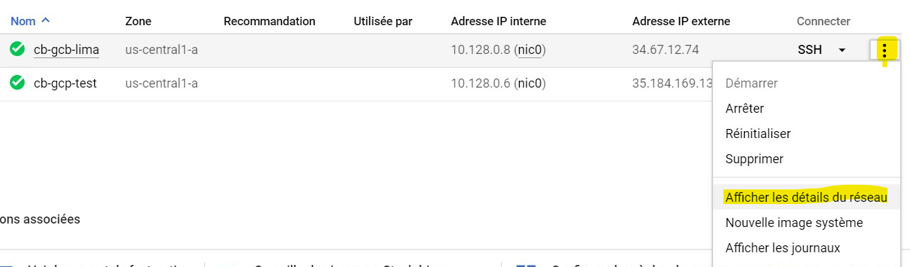
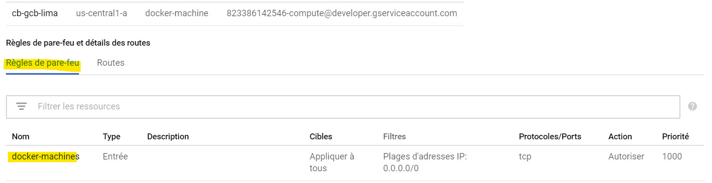
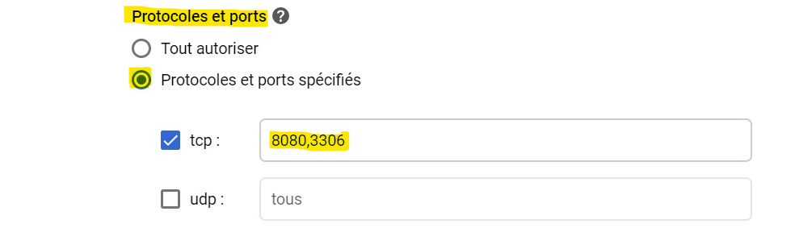

# :five: Conteneurs

Ce laboratoire permettra de créer une machine virtuelle sur un cloud public [GCP, Azure]

:closed_book: Copiez le `README.md` dans votre répertoire et cocher les sections `- [x]` au fur et à mesure de votre progression.

## :o: Sur votre PC, créer votre répertoire de travail dans `git bash`

- [x] Dans le répertoire `5.Conteneurs` Créer un répertoire avec comme nom, votre :id:

`$ mkdir ` :id:

- [x] Copier le fichier se trouvant dans le repretoire `.` dans votre répertoire

      * incluant le fichier `README.md` 


`$ cp ./README.md `:id:` `

- [x] Soumettre votre répertoire de travail vers github `(git add, commit, push)` 

## :a: Créer une machine virtuelle dans le cloud

- [x] Vérifier que vos identifiants `cloud` sont installés

```
~/.gcp/b300108234-de32988388af.json

```
- Ajouter la variable d'identifiants à son Environement

```
 export GOOGLE_APPLICATION_CREDENTIALS="$HOME/.gcp/b300108234-de32988388af.json"
```

| Cloud  |  Google  | Azure       | AWS      |  Autres |
|--------|----------|-------------|----------|---------|
| Config | `~/.gcp` | `~/.azure`  | `~/.aws` |  ...    |

- [x] Créer une machine virtuelle avec docker machine

```
$ docker-machine create --driver google --google-project excellent-bolt-272914 cb-gcb-lima


Running pre-create checks...
(cb-gcb-lima) Check that the project exists
(cb-gcb-lima) Check if the instance already exists
Creating machine...
(cb-gcb-lima) Generating SSH Key
(cb-gcb-lima) Creating host...
(cb-gcb-lima) Opening firewall ports
(cb-gcb-lima) Creating instance
(cb-gcb-lima) Waiting for Instance
(cb-gcb-lima) Uploading SSH Key
Waiting for machine to be running, this may take a few minutes...
Detecting operating system of created instance...
Waiting for SSH to be available...
Detecting the provisioner...
Provisioning with ubuntu(systemd)...
Installing Docker...
Copying certs to the local machine directory...
Copying certs to the remote machine...
Setting Docker configuration on the remote daemon...
Checking connection to Docker...
Docker is up and running!

```
- Pour activer la machine :

```
$ eval $(docker-machine env cb-gcb-lima)
```
```
$ docker-machine active
```

## :b: Créer une application de votre choix (docker ou docker compose)

- [x] Copie du fichier de configuration (i.e. Dockerfile, docker-compose.yml)

- [x] La commande `docker`, `docker-compose` utilisée pour lancer l'application

- Installer WordPress

```
$ docker-compose up --detach
```
- Initialiser WordPress

📌 Administrer le site Wordpress

http://34.67.12.74/wp-admin

📌 Visualiser MySQL avec PHPMyAdmin

http://34.67.12.74:8080


## :ab: Vérifier que l'application marche

:bulb: Faites attention au `firewall` de chaque nuage. Chaque nuage a sa propre configuration

- [x] Décrire la configuration du `firewall`

- étape à suivre:

*Selectionez la mahine vertuelle puis cliquer sur Afficher les details du réseaux



*cliquez sur Regles de pare-feu et choisissez la 1er regle sous le nom de docker-machine puis cliquer sur Modifier 



*Pour Protocoles et ports, choisissez tout autoriser




## :o: Décriver votre application et donner les accés pour la vérification 

- [x] Que fait l'application?

```
Un site web WordPress sous nom de "Tech Tutoriels", Mon 1er tutoreil sera sur les étapes à suivre pour installer et configurer Samba sur Ubuntu
```

- [x] Quel est son adresse IP?

```
34.67.12.74
```

- [x] Quel port utilisé pour y accéder?

```
Port tcp 8080 
```

## :star: Autres commentaires utiles à donner

- [x] Commentaires

*A faire 

[Participation](Participation.md)

# Références

https://github.com/CollegeBoreal/Tutoriels/tree/master/2.Virtualisation/2.VM/1.Docker
