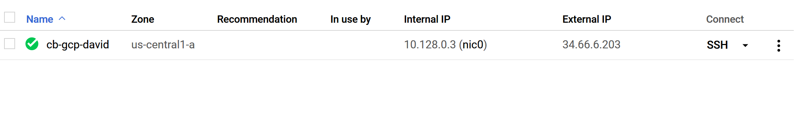
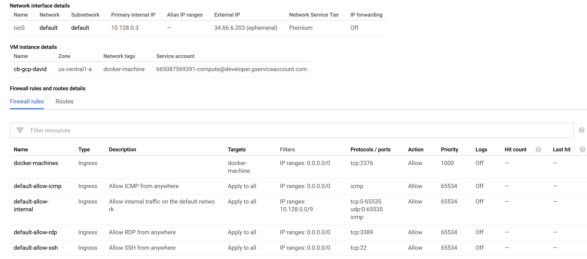

# :five: Conteneurs

Ce laboratoire permettra de créer une machine virtuelle sur un cloud public [GCP, Azure]

:closed_book: Copiez le `README.md` dans votre répertoire et cocher les sections `- [x]` au fur et à mesure de votre progression.

## :o: Sur votre PC, créer votre répertoire de travail dans `git bash`

- [✔] Dans le répertoire `5.Conteneurs` Créer un répertoire avec comme nom, votre :id:

`$ mkdir ` :id:

- [✔] Copier le fichier se trouvant dans le repretoire `.` dans votre répertoire

      * incluant le fichier `README.md` 


`$ cp ./README.md `:id:` `

- [✔] Soumettre votre répertoire de travail vers github `(git add, commit, push)` 

## :a: Créer une machine virtuelle dans le cloud

- [✔] Vérifier que vos identifiants `cloud` sont installés

| Cloud  |  Google  | Azure       | AWS      |  Autres |
|--------|----------|-------------|----------|---------|
| Config | `~/.gcp` | `~/.azure`  | `~/.aws` |  ...    |

- [✔] Créer une machine virtuelle avec docker machine

```
$ docker-machine --driver <un driver cloud> <option> ma-machine-virtuelle
```


## :b: Créer une application de votre choix (docker ou docker compose)

- [✔] Copie du fichier de configuration (i.e. Dockerfile, docker-compose.yml)

- [✔] La commande `docker`, `docker-compose` utilisée pour lancer l'application

## :ab: Vérifier que l'application marche

:bulb: Faites attention au `firewall` de chaque nuage. Chaque nuage a sa propre configuration

- [✔] Décrire la configuration du `firewall`






## :o: Décriver votre application et donner les accés pour la vérification 

- [✔] Que fait l'application?

- [✔] Quel est son adresse IP?

- [✔] Quel port utilisé pour y accéder?

## :star: Autres commentaires utiles à donner

- [ ] Commentaires

[Participation](Participation.md)

# Références

https://github.com/CollegeBoreal/Tutoriels/tree/master/2.Virtualisation/2.VM/1.Docker
