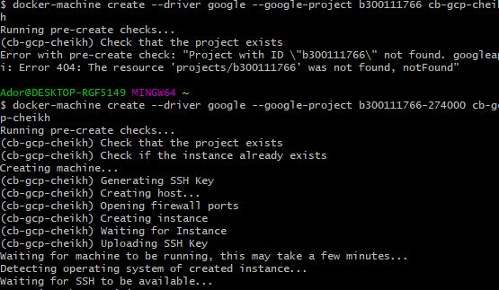

# :five: Conteneurs

Ce laboratoire permettra de créer une machine virtuelle sur un cloud public [GCP, Azure]

:closed_book: Copiez le `README.md` dans votre répertoire et cocher les sections `- [x]` au fur et à mesure de votre progression.

## :o: Sur votre PC, créer votre répertoire de travail dans `git bash`

- [✔ ] Dans le répertoire `5.Conteneurs` Créer un répertoire avec comme nom, votre :id:

`$ mkdir ` :id:

- [ ✔] Copier le fichier se trouvant dans le repretoire `.` dans votre répertoire

      * incluant le fichier `README.md` 


`$ cp ./README.md `:id:` `

- [ ✔] Soumettre votre répertoire de travail vers github `(git add, commit, push)` 

## :a: Créer une machine virtuelle dans le cloud

- [ ] Vérifier que vos identifiants `cloud` sont installés

| Cloud  |  Google  | Azure       | AWS      |  Autres |
|--------|----------|-------------|----------|---------|
| Config | `~/.gcp` | `~/.azure`  | `~/.aws` |  ...    |

- [✔ ] Créer une machine virtuelle avec docker machine
```
$ docker-machine create --driver google --google-project b300111766-274000 cb-gcp-cheikh
Running pre-create checks...
(cb-gcp-cheikh) Check that the project exists
(cb-gcp-cheikh) Check if the instance already exists
Creating machine...
(cb-gcp-cheikh) Generating SSH Key
(cb-gcp-cheikh) Creating host...
(cb-gcp-cheikh) Opening firewall ports
(cb-gcp-cheikh) Creating instance
(cb-gcp-cheikh) Waiting for Instance
(cb-gcp-cheikh) Uploading SSH Key
Waiting for machine to be running, this may take a few minutes...
Detecting operating system of created instance...
Waiting for SSH to be available...
Detecting the provisioner...
Provisioning with ubuntu(systemd)...
Installing Docker...
Copying certs to the local machine directory...
Copying certs to the remote machine...
Setting Docker configuration on the remote daemon...
Checking connection to Docker...
Docker is up and running!
To see how to connect your Docker Client to the Docker Engine running on this virtual machine, run: C:\Program Files\Docker\Docker\Resources\bin\docker-machine.exe env cb-gcp-cheikh

```
</img>

## Pointer le container engine sur la machine virtuelle
```
$  eval $(docker-machine env cb-gcp-test)
```
## Activer le container

```
$ docker-machine active
```
## :b: Créer une application de votre choix (docker ou docker compose)

- [✔ ] Copie du fichier de configuration (i.e. Dockerfile, docker-compose.yml)
- [ ✔] La commande `docker`, `docker-compose` utilisée pour lancer l'application


## Installer WordPress

```
$ docker-compose up --detach
Creating network "300111766_default" with the default driver
Creating volume "300111766_db_data" with default driver
Pulling db (mysql:latest)...
latest: Pulling from library/mysql
Digest: sha256:b69d0b62d02ee1eba8c7aeb32eba1bb678b6cfa4ccfb211a5d7931c7755dc4a8
Status: Downloaded newer image for mysql:latest
Pulling wp (wordpress:latest)...
latest: Pulling from library/wordpress
Digest: sha256:191d5caf4ef5b8c57721ade777820f3267654325f7902b2ccd377ceeba1c3fe2
Status: Downloaded newer image for wordpress:latest
Pulling wpcli (wordpress:cli)...
cli: Pulling from library/wordpress
Digest: sha256:9f165c3679042257f7c7905b0cb9491b1d3e37d78590f2b52235a968212c3f71
Status: Downloaded newer image for wordpress:cli
Creating 300111766_db_1 ... done
Creating 300111766_wp_1 ... done
Creating 300111766_wpcli_1 ... done

```

##  Activater le  Pare feu

## Initialiser WordPress

📌 Administrer votre site Wordpress

http://35.222.156.96/wp-admin/

## :ab: Vérifier que l'application marche

:bulb: Faites attention au `firewall` de chaque nuage. Chaque nuage a sa propre configuration

- [ ] Décrire la configuration du `firewall`

## :o: Décriver votre application et donner les accés pour la vérification 

- [ ✔] Que fait l'application?
```
_WordPress est un logiciel destiné à la conception et à la mise à jour dynamique de sites Web ou d'applications multimédias.
WordPress est donc un logiciel de la famille des systèmes de gestion de contenu ou encore CMS (Content Management System).
Le CMS WordPress permet à la fois de gagner du temps de développement au niveau de la création de votre site internet et d’y ajouter facilement des pages, WordPress permet donc de créer des sites dynamiques_.

```
- [ ✔] Quel est son adresse IP?

http://35.222.156.96

- [ ] Quel port utilisé pour y accéder?

8080
