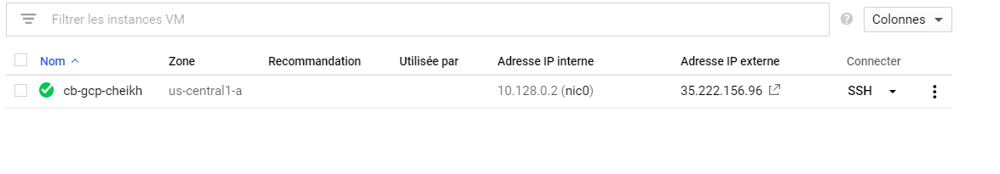

# :five: Conteneurs

Ce laboratoire permettra de créer une machine virtuelle sur un cloud public [GCP, Azure]

:closed_book: Copiez le `README.md` dans votre répertoire et cocher les sections `- [x]` au fur et à mesure de votre progression.

## :o: Sur votre PC, créer votre répertoire de travail dans `git bash`

- [✔ ] Dans le répertoire `5.Conteneurs` Créer un répertoire avec comme nom, votre :id:

`$ mkdir ` :id:

- [ ✔] Copier le fichier se trouvant dans le repretoire `.` dans votre répertoire

      * incluant le fichier `README.md` 


`$ cp ./README.md `:id:` `

- [ ✔] Soumettre votre répertoire de travail vers github `(git add, commit, push)` 

## :a: Créer une machine virtuelle dans le cloud

- [ ] Vérifier que vos identifiants `cloud` sont installés

| Cloud  |  Google  | Azure       | AWS      |  Autres |
|--------|----------|-------------|----------|---------|
| Config | `~/.gcp` | `~/.azure`  | `~/.aws` |  ...    |

- [✔ ] Créer une machine virtuelle avec docker machine

</img>

</img>

## Pointer le container engine sur la machine virtuelle
```
$  eval $(docker-machine env cb-gcp-test)
```
## Activer le container
```
$ docker-machine active
```
## :b: Créer une application de votre choix (docker ou docker compose)

- [✔ ] Copie du fichier de configuration (i.e. Dockerfile, docker-compose.yml)
- [ ✔] La commande `docker`, `docker-compose` utilisée pour lancer l'application


## Installer WordPress
```
$ docker-compose up --detach
# :five: Conteneurs

Ce laboratoire permettra de créer une machine virtuelle sur un cloud public [GCP, Azure]

:closed_book: Copiez le `README.md` dans votre répertoire et cocher les sections `- [x]` au fur et à mesure de votre progression.

## :o: Sur votre PC, créer votre répertoire de travail dans `git bash`

- [✔ ] Dans le répertoire `5.Conteneurs` Créer un répertoire avec comme nom, votre :id:

`$ mkdir ` :id:

- [ ✔] Copier le fichier se trouvant dans le repretoire `.` dans votre répertoire

      * incluant le fichier `README.md` 


`$ cp ./README.md `:id:` `

- [ ✔] Soumettre votre répertoire de travail vers github `(git add, commit, push)` 

## :a: Créer une machine virtuelle dans le cloud

- [ ] Vérifier que vos identifiants `cloud` sont installés

| Cloud  |  Google  | Azure       | AWS      |  Autres |
|--------|----------|-------------|----------|---------|
| Config | `~/.gcp` | `~/.azure`  | `~/.aws` |  ...    |

- [✔ ] Créer une machine virtuelle avec docker machine

</img>

</img>

## Pointer le container engine sur la machine virtuelle
```
$  eval $(docker-machine env cb-gcp-test)
```
## Activer le container
```
$ docker-machine active
```
## :b: Créer une application de votre choix (docker ou docker compose)

- [✔ ] Copie du fichier de configuration (i.e. Dockerfile, docker-compose.yml)
- [ ✔] La commande `docker`, `docker-compose` utilisée pour lancer l'application


## Installer WordPress
```
$ docker-compose up --detach
Creating network "300111766_default" with the default driver
Creating volume "300111766_db_data" with default driver
Creating 300111766_db_1 ... done
Creating 300111766_wp_1 ... done
Creating 300111766_wpcli_1 ... done
```
</img>

## Activation du Pare feu

## Initialiser WordPress

📌 Administrer votre site Wordpress

http://35.222.156.96/wp-admin/

## :ab: Vérifier que l'application marche

:bulb: Faites attention au `firewall` de chaque nuage. Chaque nuage a sa propre configuration

- [ ] Décrire la configuration du `firewall`

## :o: Décriver votre application et donner les accés pour la vérification 

</img>

- [ ✔] Que fait l'application?
```
WordPress est un système de gestion de contenu (SGC ou content management system (CMS) en anglais) gratuit, 
libre et open-source. Ce logiciel écrit en PHP repose sur une base de données MySQL et est distribué par l'entreprise américaine Automattic.Les fonctionnalités de WordPress lui permettent de créer et gérer différents types de sites Web : site vitrine, 
site de vente en ligne, site applicatif, blogue, ou encore portfolio. 
Il est distribué selon les termes de la licence GNU GPL version.Le logiciel est aussi utilisé 
comme socle du service multisite WordPress.com, celui ci supporte plusieurs millions de sites.
```
- [ ✔] Quel est son adresse IP?

```
http://35.222.156.96
```
- [ ] Quel port utilisé pour y accéder?
``
80
``
