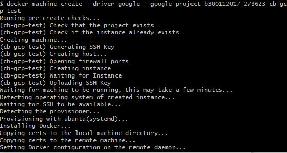
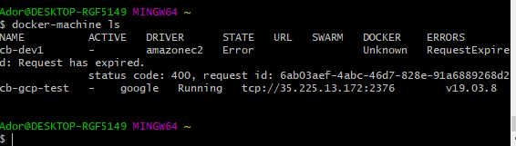

# :five: Conteneurs

Ce laboratoire permettra de créer une machine virtuelle sur un cloud public [GCP, Azure]

:closed_book: Copiez le `README.md` dans votre répertoire et cocher les sections `- [x]` au fur et à mesure de votre progression.

## :o: Sur votre PC, créer votre répertoire de travail dans `git bash`

- [✔ ] Dans le répertoire `5.Conteneurs` Créer un répertoire avec comme nom, votre :id:

`$ mkdir ` :id:

- [ ✔] Copier le fichier se trouvant dans le repretoire `.` dans votre répertoire

      * incluant le fichier `README.md` 


`$ cp ./README.md `:id:` `

- [ ✔] Soumettre votre répertoire de travail vers github `(git add, commit, push)` 

## :a: Créer une machine virtuelle dans le cloud

- [ ] Vérifier que vos identifiants `cloud` sont installés

| Cloud  |  Google  | Azure       | AWS      |  Autres |
|--------|----------|-------------|----------|---------|
| Config | `~/.gcp` | `~/.azure`  | `~/.aws` |  ...    |

- [✔ ] Créer une machine virtuelle avec docker machine

</img>

</img>

## Pointer le container engine sur la machine virtuelle
```
$  eval $(docker-machine env cb-gcp-test)
```
## Activer le container
```
$ docker-machine active
```
## :b: Créer une application de votre choix (docker ou docker compose)

- [✔ ] Copie du fichier de configuration (i.e. Dockerfile, docker-compose.yml)
- [ ✔] La commande `docker`, `docker-compose` utilisée pour lancer l'application


## Installer WordPress
```
$ docker-compose up --detach
Creating network "300112017_default" with the default driver
Creating volume "300112017_db_data" with default driver
Pulling db (mysql:latest)...
latest: Pulling from library/mysql
Digest: sha256:b69d0b62d02ee1eba8c7aeb32eba1bb678b6cfa4ccfb211a5d7931c7755dc4a8
Status: Downloaded newer image for mysql:latest
Pulling pma (phpmyadmin/phpmyadmin:)...
latest: Pulling from phpmyadmin/phpmyadmin
Digest: sha256:59912efb52a5b0342b3defc890a7041ab2a32dc2f5c9a014150006db8c55a793
Status: Downloaded newer image for phpmyadmin/phpmyadmin:latest
Pulling wp (wordpress:latest)...
latest: Pulling from library/wordpress
Digest: sha256:191d5caf4ef5b8c57721ade777820f3267654325f7902b2ccd377ceeba1c3fe2
Status: Downloaded newer image for wordpress:latest
Pulling wpcli (wordpress:cli)...
cli: Pulling from library/wordpress
Digest: sha256:9f165c3679042257f7c7905b0cb9491b1d3e37d78590f2b52235a968212c3f71
Status: Downloaded newer image for wordpress:cli
Creating 300112017_db_1 ... done
Creating 300112017_wp_1  ... done
Creating 300112017_pma_1 ... done
Creating 300112017_wpcli_1 ... done
```
## Activation du Pare feu
``
$
```
## Initialiser WordPress

Administrer votre site Wordpress

```
http://35.225.13.172/wp-admin

```
$
```
## :ab: Vérifier que l'application marche

:bulb: Faites attention au `firewall` de chaque nuage. Chaque nuage a sa propre configuration

- [ ] Décrire la configuration du `firewall`

## :o: Décriver votre application et donner les accés pour la vérification 

- [ ] Que fait l'application?

- [ ] Quel est son adresse IP?

- [ ] Quel port utilisé pour y accéder?

