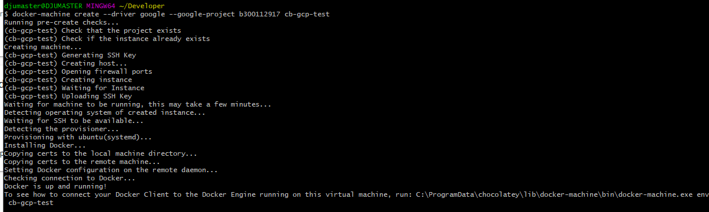
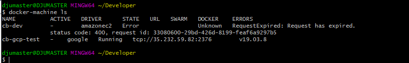

# :five: Conteneurs

Ce laboratoire permettra de créer une machine virtuelle sur un cloud public GCP

:closed_book: Copiez le `README.md` dans votre répertoire et cocher les sections `- [x]` au fur et à mesure de votre progression.

## :o: Sur votre PC, créer votre répertoire de travail dans `git bash`

- [X] Dans le répertoire `5.Conteneurs` Créer un répertoire avec comme nom, votre :id:

`$ mkdir ` :300112917:

- [X] Copier le fichier se trouvant dans le repretoire `.` dans votre répertoire

      * incluant le fichier `README.md` 


`$ cp ./README.md `:300112917:` `

- [X] Soumettre votre répertoire de travail vers github `(git add, commit, push)` 

## :a: Créer une machine virtuelle dans le cloud

- [ ] Vérifier que vos identifiants `cloud` sont installés

| Cloud  |  Google  | Azure       | AWS      |  Autres |
|--------|----------|-------------|----------|---------|
| Config | `~/.gcp` |             |          |         |

- [X] Créer une machine virtuelle avec docker machine

```
$ docker-machine create --driver google --google-project b300112917 cb-gcp-test
```
</img>

</img>
## :b: Créer une application de votre choix (docker ou docker compose)

- [X] Copie du fichier de configuration (i.e. Dockerfile, docker-compose.yml)

- [X] La commande `docker`, `docker-compose` utilisée pour lancer l'application

## :ab: Vérifier que l'application marche

:bulb: Faites attention au `firewall` de chaque nuage. Chaque nuage a sa propre configuration

- [X] Décrire la configuration du `firewall`

## :o: Décriver votre application et donner les accés pour la vérification 

- [X] Que fait l'application?

WordPress est un système de gestion de contenu (SGC ou content management system (CMS) en anglais) gratuit, libre et open-source. Les fonctionnalités de WordPress lui permettent de créer et gérer différents types de sites Web : site vitrine, site de vente en ligne, site applicatif, blogue, ou encore portfolio.

- [X] Quel est son adresse IP?
Myphp: http://35.232.59.82:8080/

WordPress: http://35.232.59.82/wp-admin

- [X] Quel port utilisé pour y accéder?
Myphp: 8080

WordPress: 
## :star: Autres commentaires utiles à donner

- [X] Commentaires

[Participation](Participation.md)

# Références

https://github.com/CollegeBoreal/Tutoriels/tree/master/2.Virtualisation/2.VM/1.Docker
>>>>>>> bf16a7557d1cd62ca8b27053ed722413e57281ce

