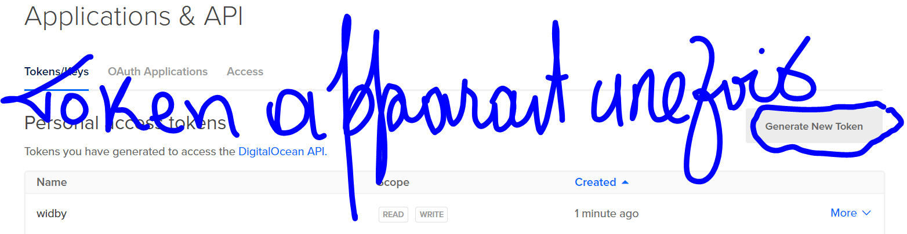
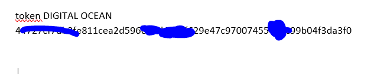
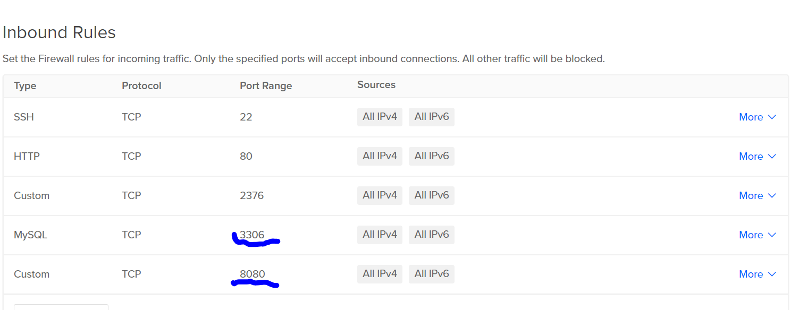

# :five: Conteneurs

[`Participation`](.scripts/Participation.md)

Ce laboratoire permettra de créer une machine virtuelle sur un cloud public [Digital OCEAN]

:closed_book: Copiez le `README.md` dans votre répertoire et cocher les sections `- [x]` au fur et à mesure de votre progression.

## [X] Sur votre PC, créer votre répertoire de travail dans `git bash`

- [X] Dans le répertoire `5.Conteneurs` Créer un répertoire avec comme nom, votre :id:

`$ mkdir ` :id:

- [x] Copier le fichier se trouvant dans le repretoire `.` dans votre répertoire

      * incluant le fichier `README.md` 


`$ cp ./README.md `:id:` `

- [X] Soumettre votre répertoire de travail vers github `(git add, commit, push)` 

## :a: Créer une machine virtuelle dans le cloud

- [X] Vérifier que vos identifiants `cloud` sont installés

| Cloud  |  Google  | Azure       | AWS      |  Digital OCEAN |
|--------|----------|-------------|----------|---------       |
| Config | `~/.gcp` | `~/.azure`  | `~/.aws` |        .ssh    |

- [X] Créer une machine virtuelle avec docker machine

```
$ docker-machine --driver <un driver cloud>(token ) ma-machine-virtuelle (widby)
```



### token


### Digital Ocean
## :b: Créer une application de votre choix (docker ou docker compose)

- [X] Copie du fichier de configuration (i.e. Dockerfile, docker-compose.yml)

- [X] La commande `docker`, `docker-compose` utilisée pour lancer l'application

## :ab: Vérifier que l'application marche

:bulb: Faites attention au `firewall` de chaque nuage. Chaque nuage a sa propre configuration

- [X] Décrire la configuration du `firewall`



## :o: Décriver votre application et donner les accés pour la vérification 

- [X] Que fait l'application?
l'application utilise Wordrepess qui est un systeme de gestion de contenu (CMS=Content management System , en anglais ) avec des themes en PHP qui vous permettra d'appliquer ces themes pour creer des sites internet avec une base de données PHP

- [x] Quel est son adresse IP?
Myphp: http://157.245.12.0:8080/

WordPress: http://157.245.12.0/wp-admin

 Quel port utilisé pour y accéder?
Myphp: 8080

WordPress:

## :star: Autres commentaires utiles à donner

- [ ] Commentaires


# Références

https://github.com/CollegeBoreal/Tutoriels/tree/master/2.Virtualisation/2.VM/1.Docker
