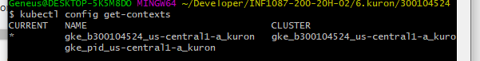

# :six: Kuron (prononcer Couronne)

Ce laboratoire permettra de créer une grappe sur le cloud public [GCP]. 

:closed_book: Copiez le `README.md` et le répertoire `.src` dans votre répertoire :id: et cocher les sections `- [x]` au fur et à mesure de votre progression.

## :o: Sur votre PC, créer votre répertoire de travail dans `git bash`

- [x] Dans le répertoire `6.Kuron` Créer un répertoire avec comme nom, votre :id:

`$ mkdir ` :id:

- [x] Copier les fichiers se trouvant dans le répertoire `.` dans votre répertoire :id:

      * incluant le fichier `README.md` 

      * incluant le répertoire `.src` 


`$ cp ./README.md `:id:` `

`$ cp -r .src/* `:id:` `

- [x] Soumets ton répertoire de travail vers github `(git add, commit, push)` 


## :star: Prérequis

- [x] Compte GCP

Assures toi d'avoir ton compte sur https://console.cloud.google.com/

- [x] Identifiants GCP 

Assures toi d'avoir positionner tes identifiants `google`

```
$ $env:GOOGLE_APPLICATION_CREDENTIALS="$env:USERPROFILE\.gcp\b300104524-38d76c1cec7c.json"

## :a: Créer sa grappe `kuron`

- [ ] Crée ta grappe `kuron` avec 3 VM (noeuds)

```
$ gcloud beta container clusters create "kuron" --zone "us-central1-a" \
                        --num-nodes "3" --release-channel "rapid" \
                        --machine-type "g1-small" --image-type "COS" \
                        --disk-type "pd-standard" --disk-size "30" \
                        --no-enable-stackdriver-kubernetes --no-enable-basic-auth \
                        --no-enable-master-authorized-networks \
                        --addons HorizontalPodAutoscaling,HttpLoadBalancing \
                        --enable-autoupgrade --enable-autorepair --enable-ip-alias                
```



:round_pushpin: Assures toi d'activer ton context avec `kubectl`, vérifie l'étoile

```
$ kubectl config get-contexts
CURRENT   NAME                          CLUSTER                       AUTHINFO                        NAMESPACE
*         gke_pid_us-central1-a_kuron   gke_pid_us-central1-a_kuron   gke_pid_us-central1-a_kuron   
```

* Changes de contexte si ce n'est pas le cas, exemple

```
$ kubectl config set-context gke_pid_us-central1-a_kuron
```

:round_pushpin: Visualise quelques informations sur ta grappe

```
$ kubectl cluster-info                 
```

- [ ] Vérifie que tes :three: `noeuds` (VMs) soient dans un état `Ready`

```
% kubectl get nodes
NAME                                   STATUS   ROLES    AGE     VERSION
gke-kuron-default-pool-1e3feddf-8s94   Ready    <none>   2m32s   v1.16.8-gke.8
gke-kuron-default-pool-1e3feddf-c4tn   Ready    <none>   2m32s   v1.16.8-gke.8
gke-kuron-default-pool-1e3feddf-p2j8   Ready    <none>   2m32s   v1.16.8-gke.8
```

## :b: Déploie ton application `kuron`

https://hub.docker.com/r/collegeboreal/kuron

Nous allons utiliser l'image `collegeboreal/kuron` pour créer notre application. Tu as un lien ci-dessus pour plus de détail pour construire l'image.

Les applications ou `pod` sont des conteneurs où tournent l'application, dans notre cas un serveur `node` nous donnant le nom du conteneur.

- [x] Utilise le fichier `kuron-deployment.yaml` pour déployer tes `pods`

```
$ kubectl apply -f kuron-deployment.yaml 
```

- [x] Vérifie que tes :three: `pods` soient dans un état de tourner `running`

```
$ kubectl get pods                                                              
NAME                               READY   STATUS    RESTARTS   AGE
kuron-deployment-8bf4f7f9f-5hm4n   1/1     Running   0          20m
kuron-deployment-8bf4f7f9f-d4d9l   1/1     Running   0          20m
kuron-deployment-8bf4f7f9f-xw4gz   1/1     Running   0          20m
```

## :ab: Déploie le service `kuron-deployment-service`

Le service permet la publication des ports vers l'extérieur. Le port que nous allons utiliser et le port `8080`

- [ ] Utilise le fichier `kuron-deployment-service.yaml` pour ouvrir les `ports`

```
$ kubectl apply -f kuron-deployment-service.yaml 
```

:round_pushpin: Vérifie ton service et note l'adresse IP externe et le port d'accès

```
$ kubectl get services                                                          
NAME                       TYPE           CLUSTER-IP    EXTERNAL-IP    PORT(S)          AGE
kubernetes                 ClusterIP      10.32.0.1     <none>         443/TCP          8m3s
kuron-deployment-service   LoadBalancer   10.32.13.64   34.71.18.253   8080:30010/TCP   39s
```

- [ ] Publie ton site Internet avec les informations du service

http://34.71.18.253:8080

## :o: Teste ton application en prouvant que tes `pods` tournent sur un service redondant

- [x] Liste ton `service`

```
$ kubectl get services    
NAME                       TYPE           CLUSTER-IP    EXTERNAL-IP    PORT(S)          AGE
kubernetes                 ClusterIP      10.32.0.1     <none>         443/TCP          8m3s
kuron-deployment-service   LoadBalancer   10.32.13.64   34.71.18.253   8080:30010/TCP   39s
```

* Note l'adresse IP locale de ton cluster, dans ce cas `10.32.13.64` 

- [x] Liste tes `pods`

```
$ kubectl get pods
NAME                               READY   STATUS    RESTARTS   AGE
kuron-deployment-8bf4f7f9f-jtbvg   1/1     Running   0          3m39s
kuron-deployment-8bf4f7f9f-q7h6h   1/1     Running   0          3m39s
kuron-deployment-8bf4f7f9f-rvt9w   1/1     Running   0          3m39s
```

* Note le nom de tes trois `pods` ou conteneurs, i.e. `kuron-deployment-8bf4f7f9f-rvt9w`, `kuron-deployment-8bf4f7f9f-q7h6h`


- [x] Tapes les commandes ci-dessous en changeant le nom des pods et l'adresse IP locale.

Le programme javascript qui tourne dans les pods récupère le nom du conteneur dans ce cas le nom du pod.

:bulb: Remarque le nom du pod retourné change et n'est pas forcément le nom du pod pourtant le nom du pod dans la commande est le même

:bangbang: Respecte le séparateur de commande `--` devant la commande `curl`

1. Test

```
$ kubectl exec kuron-deployment-8bf4f7f9f-jtbvg -- curl -s http://10.32.13.64:8080
Tu as touché kuron-deployment-8bf4f7f9f-q7h6h
```

2. Test

```
$ kubectl exec kuron-deployment-8bf4f7f9f-jtbvg -- curl -s http://10.32.13.64:8080
Tu as touché kuron-deployment-8bf4f7f9f-rvt9w     
```

3. Test

```
$ kubectl exec kuron-deployment-8bf4f7f9f-jtbvg -- curl -s http://10.32.13.64:8080
Tu as touché kuron-deployment-8bf4f7f9f-jtbvg
```

- [x] Finalement, Va dans un pod (conteneur) et donne la taille mémoire du pod avec la commande `top`

```
$ kubectl exec --stdin --tty  kuron-deployment-8bf4f7f9f-jtbvg -- bash
```

KiB Mem:   1732772


## :x: Après la fin du cours, supprime ta grappe (attendre la note finale)

1. soit par la console [`Google`](https://console.cloud.google.com/)

1. soit par la commande
```
$ gcloud container clusters delete kuron --zone "us-central1-a"
```


# [Participation](Participation.md)

# Références

https://github.com/CollegeBoreal/Tutoriels/tree/master/2.Virtualisation/2.VM/1.Docker

