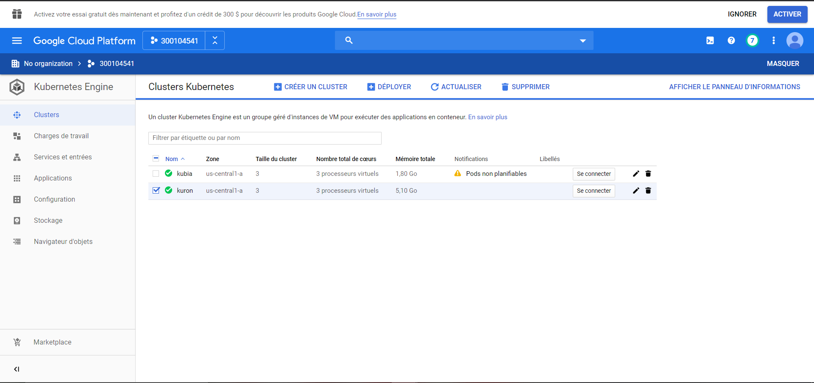

# :six: Kuron (prononcer Couronne)

Ce laboratoire permettra de créer une grappe sur le cloud public [GCP]. 

:closed_book: Copiez le `README.md` et le répertoire `.src` dans votre répertoire :id: et cocher les sections `- [x]` au fur et à mesure de votre progression.

## :o: Sur votre PC, créer votre répertoire de travail dans `git bash`

- [ ] Dans le répertoire `6.Kuron` Créer un répertoire avec comme nom, votre :id:

`$ mkdir `300104541` `

- [ ] Copier les fichiers se trouvant dans le répertoire `.` dans votre répertoire :id:

      * incluant le fichier `README.md` 

      * incluant le répertoire `.src` 


`$ cp ./README.md `300104541` `

`$ cp -r .src `300104541` `

- [x] Soumets ton répertoire de travail vers github `(git add, commit, push)` 


## :star: Prérequis

- [x] Compte GCP

Assures toi d'avoir ton compte sur https://console.cloud.google.com/

- [ ] Identifiants GCP 

Assures toi d'avoir positionner tes identifiants `google`

```
$env:GOOGLE_APPLICATION_CREDENTIALS="$env:USERPROFILE\.gcp\/300104541-80946978cdc8.json"
```

## :a: Créer sa grappe `kuron`

- [x] Crée ta grappe `kuron` avec 3 VM (noeuds)

```
gcloud beta container clusters create "kuron" --zone "us-central1-a" `
>>                         --num-nodes "3" --release-channel "rapid" `
>>                         --machine-type "g1-small" --image-type "COS" `
>>                         --disk-type "pd-standard" --disk-size "30" `
>>                         --no-enable-stackdriver-kubernetes --no-enable-basic-auth `
>>                         --no-enable-master-authorized-networks `
>>                         --addons HorizontalPodAutoscaling,HttpLoadBalancing `
>>                         --enable-autoupgrade --enable-autorepair --enable-ip-alias
WARNING: Starting with version 1.18, clusters will have shielded GKE nodes by default.
WARNING: The Pod address range limits the maximum size of the cluster. Please refer to https://cloud.google.com/kubernetes-engine/docs/how-to/flexible-pod-cidr to learn how to optimize IP address allocation.
This will enable the autorepair feature for nodes. Please see https://cloud.google.com/kubernetes-engine/docs/node-auto-repair for more information on node autorepairs.
Creating cluster kuron in us-central1-a... Cluster is being health-checked (master is healthy)...done.
Created [https://container.googleapis.com/v1beta1/projects/focal-set-273615/zones/us-central1-a/clusters/kuron].
To inspect the contents of your cluster, go to: https://console.cloud.google.com/kubernetes/workload_/gcloud/us-central1-a/kuron?project=focal-set-273615
kubeconfig entry generated for kuron.
NAME   LOCATION       MASTER_VERSION  MASTER_IP     MACHINE_TYPE  NODE_VERSION  NUM_NODES  STATUS
kuron  us-central1-a  1.16.8-gke.8    34.71.217.85  g1-small      1.16.8-gke.8  3          RUNNING
           
```



:round_pushpin: Assures toi d'activer ton context avec `kubectl`, vérifie l'étoile

```
$ kubectl config get-contexts
CURRENT   NAME                                       CLUSTER                                    AUTHINFO                                   NAMESPACE
          gke_focal-set-273615_us-central1-a_kubia   gke_focal-set-273615_us-central1-a_kubia   gke_focal-set-273615_us-central1-a_kubia
*         gke_focal-set-273615_us-central1-a_kuron   gke_focal-set-273615_us-central1-a_kuron   gke_focal-set-273615_us-central1-a_kuron  
```

* Changes de contexte si ce n'est pas le cas, exemple

```
$ kubectl config set-context gke_pid_us-central1-a_kuron
Context "gke_pid_us-central1-a_kuron" created.
```

:round_pushpin: Visualise quelques informations sur ta grappe

```
$ kubectl cluster-info 
Kubernetes master is running at https://34.71.217.85
GLBCDefaultBackend is running at https://34.71.217.85/api/v1/namespaces/kube-system/services/default-http-backend:http/proxy
KubeDNS is running at https://34.71.217.85/api/v1/namespaces/kube-system/services/kube-dns:dns/proxy
Metrics-server is running at https://34.71.217.85/api/v1/namespaces/kube-system/services/https:metrics-server:/proxy

To further debug and diagnose cluster problems, use 'kubectl cluster-info dump'.
```

- [ ] Vérifie que tes :three: `noeuds` (VMs) soient dans un état `Ready`

```
% kubectl get nodes
NAME                                   STATUS   ROLES    AGE     VERSION
gke-kuron-default-pool-4bea9e21-5ssx   Ready    <none>   4m38s   v1.16.8-gke.8
gke-kuron-default-pool-4bea9e21-jkjc   Ready    <none>   4m38s   v1.16.8-gke.8
gke-kuron-default-pool-4bea9e21-x2r5   Ready    <none>   4m38s   v1.16.8-gke.8
```

## :b: Déploie ton application `kuron`

https://hub.docker.com/r/collegeboreal/kuron

Nous allons utiliser l'image `collegeboreal/kuron` pour créer notre application. Tu as un lien ci-dessus pour plus de détail pour construire l'image.

Les applications ou `pod` sont des conteneurs où tournent l'application, dans notre cas un serveur `node` nous donnant le nom du conteneur.

- [ ] Utilise le fichier `kuron-deployment.yaml` pour déployer tes `pods`

```
$ kubectl apply -f kuron-deployment.yaml 
(base) PS C:\Users\Amichia\Developer\INF1087-200-20H-02\6.kuron\300104541> kubectl apply -f kuron-deployment-service.yaml
service/kuron-deployment-service created
```

- [ ] Vérifie que tes :three: `pods` soient dans un état de tourner `running`

```
$ kubectl get pods  
NAME                               READY   STATUS    RESTARTS   AGE
kuron-deployment-8bf4f7f9f-22nn8   1/1     Running   0          61m
kuron-deployment-8bf4f7f9f-rzfd2   1/1     Running   0          61m
kuron-deployment-8bf4f7f9f-xm6v6   1/1     Running   0          61m

```

## :ab: Déploie le service `kuron-deployment-service`

Le service permet la publication des ports vers l'extérieur. Le port que nous allons utiliser et le port `8080`

- [ ] Utilise le fichier `kuron-deployment-service.yaml` pour ouvrir les `ports`

```
$ kubectl apply -f kuron-deployment-service.yaml 
```

:round_pushpin: Vérifie ton service et note l'adresse IP externe et le port d'accès

```
$ kubectl get services                                                          
NAME                       TYPE           CLUSTER-IP   EXTERNAL-IP      PORT(S)          AGE
kubernetes                 ClusterIP      10.32.0.1    <none>           443/TCP          133m
kuron-deployment-service   LoadBalancer   10.32.5.27   35.192.145.202   8080:31441/TCP   55m
```

- [ ] Publie ton site Internet avec les informations du service

http://35.192.145.202:8080

## :o: Teste ton application en prouvant que tes `pods` tournent sur un service redondant

- [ ] Liste ton `service`

```
$ kubectl get services
NAME                       TYPE           CLUSTER-IP   EXTERNAL-IP      PORT(S)          AGE
kubernetes                 ClusterIP      10.32.0.1    <none>           443/TCP          133m
kuron-deployment-service   LoadBalancer   10.32.5.27   35.192.145.202   8080:31441/TCP   55m

```

* Note l'adresse IP locale de ton cluster, dans ce cas `10.32.5.27` 

- [ ] Liste tes `pods`

```
$ kubectl get pods
NAME                               READY   STATUS    RESTARTS   AGE
kuron-deployment-8bf4f7f9f-22nn8   1/1     Running   0          61m
kuron-deployment-8bf4f7f9f-rzfd2   1/1     Running   0          61m
kuron-deployment-8bf4f7f9f-xm6v6   1/1     Running   0          61m

```

* Note le nom de tes trois `pods` ou conteneurs, i.e. `kuron-deployment-8bf4f7f9f-5hm4n`, `kuron-deployment-8bf4f7f9f-d4d9l`


- [ ] Tapes les commandes ci-dessous en changeant le nom des pods et l'adresse IP locale.

Le programme javascript qui tourne dans les pods récupère le nom du conteneur dans ce cas le nom du pod.

:warning: Remarque le nom du pod retourné change et n'est pas forcément le nom du pod

:bangbang: Respecte le séparateur de commande `--` devant la commande `curl`

```
base) PS C:\Users\Amichia\Developer\INF1087-200-20H-02\6.kuron\300104541> kubectl exec kuron-deployment-8bf4f7f9f-22nn8 -- curl -s http://10.32.5.27:8080
Tu as touché kuron-deployment-8bf4f7f9f-xm6v6
```


```
(base) PS C:\Users\Amichia\Developer\INF1087-200-20H-02\6.kuron\300104541> kubectl exec kuron-deployment-8bf4f7f9f-22nn8 -- curl -s http://10.32.5.27:8080
Tu as touché kuron-deployment-8bf4f7f9f-22nn8
```

```
(base) PS C:\Users\Amichia\Developer\INF1087-200-20H-02\6.kuron\300104541> kubectl exec kuron-deployment-8bf4f7f9f-22nn8 -- curl -s http://10.32.5.27:8080
Tu as touché kuron-deployment-8bf4f7f9f-rzfd2
```
(base) PS C:\Users\Amichia\Developer\INF1087-200-20H-02\6.kuron\300104541> kubectl exec kuron-deployment-8bf4f7f9f-22nn8 -- curl -s http://10.32.5.27:8080
Tu as touché kuron-deployment-8bf4f7f9f-rzfd2
```


- [ ] Finalement, aller dans un pod (conteneur) et donner la taille mémoire du pod avec la commande `top`

```
(base) PS C:\Users\Amichia\Developer\INF1087-200-20H-02\6.kuron\300104541> kubectl exec --stdin --tty  kuron-deployment-8bf4f7f9f-22nn8 -- /bin/bash
root@kuron-deployment-8bf4f7f9f-22nn8:/#
```

KiB Mem:   1732772


## :x: Après la fin du cours, supprime ta grappe (attendre la note finale)

1. soit par la console [`Google`](https://console.cloud.google.com/)

1. soit par la commande
```
$ gcloud container clusters delete kuron --zone "us-central1-a"
```


# [Participation](Participation.md)

# Références

https://github.com/CollegeBoreal/Tutoriels/tree/master/2.Virtualisation/2.VM/1.Docker

https://github.com/CollegeBoreal/INF1087-200-20H-02/tree/master/K.Kubernetes
