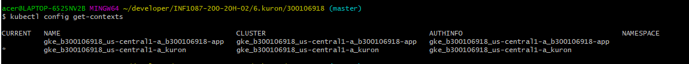

# :six: Kuron (prononcer Couronne)

Ce laboratoire permettra de créer une grappe sur le cloud public [GCP]. 

:closed_book: Copiez le `README.md` et le répertoire `.src` dans votre répertoire :id: et cocher les sections `- [x]` au fur et à mesure de votre progression.

## :o: Sur votre PC, créer votre répertoire de travail dans `git bash`

- [x] Dans le répertoire `6.Kuron` Créer un répertoire avec comme nom, votre :id:

`$ mkdir ` :id:

- [x] Copier les fichiers se trouvant dans le répertoire `.` dans votre répertoire :id:

      * incluant le fichier `README.md` 

      * incluant le répertoire `.src` 


`$ cp ./README.md `:id:` `

`$ cp -r .src `:id:` `

- [x] Soumets ton répertoire de travail vers github `(git add, commit, push)` 


## :star: Prérequis

- [x] Compte GCP

Assures toi d'avoir ton compte sur https://console.cloud.google.com/

- [x] Identifiants GCP 

Assures toi d'avoir positionner tes identifiants `google`

```
export GOOGLE_APPLICATION_CREDENTIALS="$HOME/.gcp/b300106918-193e1309da77.json"
```
 
## :a: Créer sa grappe `kuron`

- [ ] Crée ta grappe `kuron` avec 3 VM (noeuds)

```
$ gcloud beta container clusters create "kuron" --zone "us-central1-a" \
                        --num-nodes "3" --release-channel "rapid" \
                        --machine-type "g1-small" --image-type "COS" \
                        --disk-type "pd-standard" --disk-size "30" \
                        --no-enable-stackdriver-kubernetes --no-enable-basic-auth \
                        --no-enable-master-authorized-networks \
                        --addons HorizontalPodAutoscaling,HttpLoadBalancing \
                        --enable-autoupgrade --enable-autorepair --enable-ip-alias                
```


:round_pushpin: Assures toi d'activer ton context avec `kubectl`, vérifie l'étoile

```


```

$ kubectl config get-contexts




```
:round_pushpin: Visualise quelques informations sur ta grappe

```
$ kubectl cluster-info  


```

- [ ] Vérifie que tes :three: `noeuds` (VMs) soient dans un état `Ready`

```
% kubectl get nodes


```

$ kubectl apply -f kuron-deployment.yaml 
```

- [ ] Vérifie que tes :three: `pods` soient dans un état de tourner `running`


## :ab: Déploie le service `kuron-deployment-service`

Le service permet la publication des ports vers l'extérieur. Le port que nous allons utiliser et le port `8080`

- [ ] Utilise le fichier `kuron-deployment-service.yaml` pour ouvrir les `ports`

```
$ kubectl apply -f kuron-deployment-service.yaml 
```

:round_pushpin: Vérifie ton service et note l'adresse IP externe et le port d'accès


```

- [ ] Publie ton site Internet avec les informations du service

http://10.32.13.153:8080

## :o: Teste ton application en prouvant que tes `pods` tournent sur un service redondant

- [ ] Liste ton `service`

```
$ kubectl get services                                                          


* Note l'adresse IP locale de ton cluster, dans ce cas `10.32.3.1` 

- [ ] Liste tes `pods`

```
$ kubectl get pods                                                              

* Note le nom de tes trois `pods` ou conteneurs, i.e. `kuron-deployment-8bf4f7f9f-5hm4n`, `kuron-deployment-8bf4f7f9f-d4d9l`


- [ ] Tapes les commandes ci-dessous en changeant le nom des pods et l'adresse IP locale.

Le programme javascript qui tourne dans les pods récupère le nom du conteneur dans ce cas le nom du pod.

:warning: Remarque le nom du pod retourné change et n'est pas forcément le nom du pod

:bangbang: Respecte le séparateur de commande `--` devant la commande `curl`

```


   
   
   
   
- [ ] Finalement, aller dans un pod (conteneur) et donner la taille mémoire du pod avec la commande `top`

```
$ winpty kubectl exec --stdin --tty  kuron-deployment-8bf4f7f9f-68v8k -- /bin/bash
```

KiB Mem:   1732772


## :x: Après la fin du cours, supprime ta grappe (attendre la note finale)

1. soit par la console [`Google`](https://console.cloud.google.com/)

1. soit par la commande
```
$ gcloud container clusters delete kuron --zone "us-central1-a"
```


# [Participation](Participation.md)

# Références

https://github.com/CollegeBoreal/Tutoriels/tree/master/2.Virtualisation/2.VM/1.Docker

https://github.com/CollegeBoreal/INF1087-200-20H-02/tree/master/K.Kubernetes
