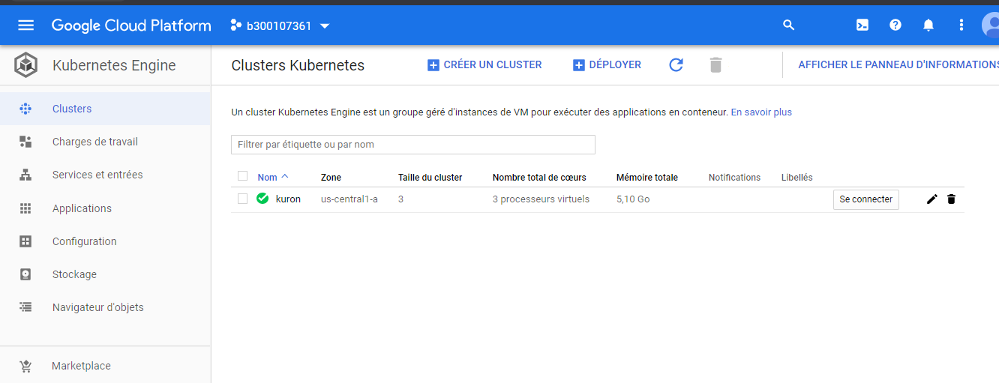

# :six: Kuron (prononcer Couronne)

Ce laboratoire permettra de créer une grappe sur le cloud public [GCP]. 

:closed_book: Copiez le `README.md` et le répertoire `.src` dans votre répertoire :id: et cocher les sections `- [x]` au fur et à mesure de votre progression.

## :o: Sur votre PC, créer votre répertoire de travail dans `git bash`

- [x] Dans le répertoire `6.Kuron` Créer un répertoire avec comme nom, votre :id:

`$ mkdir ` :id:

- [x] Copier les fichiers se trouvant dans le répertoire `.` dans votre répertoire :id:

      * incluant le fichier `README.md` 

      * incluant le répertoire `.src` 


`$ cp ./README.md `:id:` `

`$ cp -r .src/* `:id:` `

- [x] Soumets ton répertoire de travail vers github `(git add, commit, push)` 


## :star: Prérequis

- [x] Compte GCP

Assures toi d'avoir ton compte sur https://console.cloud.google.com/

- [x] Identifiants GCP 

Assures toi d'avoir positionner tes identifiants `google`

* avec Powershell

```
PS C:\Users\Tochgaly-K.J.Etienne> $env:GOOGLE_APPLICATION_CREDENTIALS="C:\Users\Tochgaly-K.J.Etienne\.gcp\b300107361-274400-c449e4bb3ffd.json"
```


## :a: Créer sa grappe `kuron`

- [x] Crée ta grappe `kuron` avec 3 VM (noeuds)

* avec Powershell

```
PS C:\Users\Tochgaly-K.J.Etienne> gcloud beta container clusters create "kuron" --zone "us-central1-a" `
>>                         --num-nodes "3" --release-channel "rapid" `
>>                         --machine-type "g1-small" --image-type "COS" `
>>                         --disk-type "pd-standard" --disk-size "30" `
>>                         --no-enable-stackdriver-kubernetes --no-enable-basic-auth `
>>                         --no-enable-master-authorized-networks `
>>                         --addons HorizontalPodAutoscaling,HttpLoadBalancing `
>>                         --enable-autoupgrade --enable-autorepair --enable-ip-alias
WARNING: Starting with version 1.18, clusters will have shielded GKE nodes by default.
WARNING: The Pod address range limits the maximum size of the cluster. Please refer to https://cloud.google.com/kubernetes-engine/docs/how-to/flexible-pod-cidr to learn how to optimize IP address allocation.
This will enable the autorepair feature for nodes. Please see https://cloud.google.com/kubernetes-engine/docs/node-auto-repair for more information on node autorepairs.
Creating cluster kuron in us-central1-a... Cluster is being health-checked (master is healthy
)...done.
Created [https://container.googleapis.com/v1beta1/projects/b300107361-274400/zones/us-central1-a/clusters/kuron].
To inspect the contents of your cluster, go to: https://console.cloud.google.com/kubernetes/workload_/gcloud/us-central1-a/kuron?project=b300107361-274400
kubeconfig entry generated for kuron.
NAME   LOCATION       MASTER_VERSION  MASTER_IP       MACHINE_TYPE  NODE_VERSION  NUM_NODES  STATUS
kuron  us-central1-a  1.16.8-gke.8    35.239.178.207  g1-small      1.16.8-gke.8  3          RUNNING                
```




:round_pushpin: Assures toi d'activer ton context avec `kubectl`, vérifie l'étoile

```
PS C:\Users\Tochgaly-K.J.Etienne> kubectl config get-contexts
CURRENT   NAME                                        CLUSTER                                     AUTHINFO                                    NAMESPACE
*         gke_b300107361-274400_us-central1-a_kuron   gke_b300107361-274400_us-central1-a_kuron   gke_b300107361-274400_us-central1-a_kuron
          gke_b300107361_us-central1-a_joker          gke_b300107361_us-central1-a_joker          gke_b300107361_us-central1-a_joker
```


:round_pushpin: Visualise quelques informations sur ta grappe

```
PS C:\Users\Tochgaly-K.J.Etienne> kubectl cluster-info
Kubernetes master is running at https://35.239.178.207
GLBCDefaultBackend is running at https://35.239.178.207/api/v1/namespaces/kube-system/services/default-http-backend:http/proxy
KubeDNS is running at https://35.239.178.207/api/v1/namespaces/kube-system/services/kube-dns:dns/proxy
Metrics-server is running at https://35.239.178.207/api/v1/namespaces/kube-system/services/https:metrics-server:/proxy                 
```

- [x] Vérifie que tes :three: `noeuds` (VMs) soient dans un état `Ready`

```
PS C:\Users\Tochgaly-K.J.Etienne> kubectl get nodes
NAME                                   STATUS   ROLES    AGE   VERSION
gke-kuron-default-pool-50a0032c-5q4d   Ready    <none>   21m   v1.16.8-gke.8
gke-kuron-default-pool-50a0032c-pvjk   Ready    <none>   21m   v1.16.8-gke.8
gke-kuron-default-pool-50a0032c-vbc0   Ready    <none>   21m   v1.16.8-gke.8
```

## :b: Déploie ton application `kuron`

https://hub.docker.com/r/collegeboreal/kuron

Nous allons utiliser l'image `collegeboreal/kuron` pour créer notre application. Tu as un lien ci-dessus pour plus de détail pour construire l'image.

Les applications ou `pod` sont des conteneurs où tournent l'application, dans notre cas un serveur `node` nous donnant le nom du conteneur.

- [x] Utilise le fichier `kuron-deployment.yaml` pour déployer tes `pods`

```
PS C:\Users\Tochgaly-K.J.Etienne> kubectl apply -f kuron-deployment.yaml
deployment.apps/kuron-deployment created 
```

- [x] Vérifie que tes :three: `pods` soient dans un état de tourner `running`

```
PS C:\Users\Tochgaly-K.J.Etienne> kubectl get pods
NAME                               READY   STATUS              RESTARTS   AGE
kuron-deployment-8bf4f7f9f-2b5d9   0/1     ContainerCreating   0          26s
kuron-deployment-8bf4f7f9f-k2ssk   0/1     ContainerCreating   0          26s
kuron-deployment-8bf4f7f9f-rlwf7   0/1     ContainerCreating   0          26s
```

## :ab: Déploie le service `kuron-deployment-service`

Le service permet la publication des ports vers l'extérieur. Le port que nous allons utiliser et le port `8080`

- [x] Utilise le fichier `kuron-deployment-service.yaml` pour ouvrir les `ports`

```
PS C:\Users\Tochgaly-K.J.Etienne> kubectl apply -f kuron-deployment-service.yaml
service/kuron-deployment-service created 
```

:round_pushpin: Vérifie ton service et note l'adresse IP externe et le port d'accès

```
PS C:\Users\Tochgaly-K.J.Etienne> kubectl get services
NAME                       TYPE           CLUSTER-IP    EXTERNAL-IP     PORT(S)          AGE
kubernetes                 ClusterIP      10.32.0.1     <none>          443/TCP          36m
kuron-deployment-service   LoadBalancer   10.32.6.158   35.232.136.83   8080:32205/TCP   58s
```

- [x] Publie ton site Internet avec les informations du service

http://35.232.136.83:8080

## :o: Teste ton application en prouvant que tes `pods` tournent sur un service redondant

- [x] Liste ton `service`

```
PS C:\Users\Tochgaly-K.J.Etienne> kubectl get services
NAME                       TYPE           CLUSTER-IP    EXTERNAL-IP     PORT(S)          AGE
kubernetes                 ClusterIP      10.32.0.1     <none>          443/TCP          40m
kuron-deployment-service   LoadBalancer   10.32.6.158   35.232.136.83   8080:32205/TCP   4m49s
```

* Note l'adresse IP locale de ton cluster, dans ce cas `10.32.6.158` 

- [x] Liste tes `pods`

```
PS C:\Users\Tochgaly-K.J.Etienne> kubectl get pods
NAME                               READY   STATUS    RESTARTS   AGE
kuron-deployment-8bf4f7f9f-2b5d9   1/1     Running   0          10m
kuron-deployment-8bf4f7f9f-k2ssk   1/1     Running   0          10m
kuron-deployment-8bf4f7f9f-rlwf7   1/1     Running   0          10m
```

* Note le nom de tes trois `pods` ou conteneurs, i.e. `kuron-deployment-8bf4f7f9f-2b5d9`, `kuron-deployment-8bf4f7f9f-k2ssk`


- [x] Tapes les commandes ci-dessous en changeant le nom des pods et l'adresse IP locale.

Le programme javascript qui tourne dans les pods récupère le nom du conteneur dans ce cas le nom du pod.

:warning: Remarque le nom du pod retourné change et n'est pas forcément le nom du pod

:bangbang: Respecte le séparateur de commande `--` devant la commande `curl`

```
PS C:\Users\Tochgaly-K.J.Etienne> kubectl exec kuron-deployment-8bf4f7f9f-2b5d9 -- curl -s http://35.232.136.83:8080
Tu as touché kuron-deployment-8bf4f7f9f-k2ssk
```

```
PS C:\Users\Tochgaly-K.J.Etienne> kubectl exec kuron-deployment-8bf4f7f9f-2b5d9 -- curl -s http://35.232.136.83:8080
Tu as touché kuron-deployment-8bf4f7f9f-2b5d9
```

```
PS C:\Users\Tochgaly-K.J.Etienne> kubectl exec kuron-deployment-8bf4f7f9f-2b5d9 -- curl -s http://35.232.136.83:8080
Tu as touché kuron-deployment-8bf4f7f9f-rlwf7
```

```
PS C:\Users\Tochgaly-K.J.Etienne> kubectl exec kuron-deployment-8bf4f7f9f-2b5d9 -- curl -s http://35.232.136.83:8080
>> Tu as touché kuron-deployment-8bf4f7f9f-rlwf7
```

```
PS C:\Users\Tochgaly-K.J.Etienne> kubectl exec kuron-deployment-8bf4f7f9f-2b5d9 -- curl -s http://35.232.136.83:8080
Tu as touché kuron-deployment-8bf4f7f9f-2b5d9
```

- [x] Finalement, aller dans un pod (conteneur) et donner la taille mémoire du pod avec la commande `top`

```
$ PS C:\Users\Tochgaly-K.J.Etienne> kubectl exec --stdin --tty  kuron-deployment-8bf4f7f9f-2b5d9 -- /bin/bash
root@kuron-deployment-8bf4f7f9f-2b5d9:/# top
top - 02:44:37 up 58 min,  0 users,  load average: 0.05, 0.08, 0.07
Tasks:   3 total,   1 running,   2 sleeping,   0 stopped,   0 zombie
%Cpu(s):  1.7 us,  1.3 sy,  0.0 ni, 97.0 id,  0.0 wa,  0.0 hi,  0.0 si,  0.0 st
KiB Mem:   1732772 total,  1634496 used,    98276 free,    38408 buffers
KiB Swap:        0 total,        0 used,        0 free.  1129760 cached Mem

    PID USER      PR  NI    VIRT    RES    SHR S %CPU %MEM     TIME+ COMMAND
      1 root      20   0  813604  25960  19252 S  0.0  1.5   0:00.14 node
     41 root      20   0   20248   3228   2748 S  0.0  0.2   0:00.00 bash
     46 root      20   0   21952   2456   2080 R  0.0  0.1   0:00.00 top


root@kuron-deployment-8bf4f7f9f-2b5d9:/# exit
exit
```


`KiB Mem:   1732772`


## :x: Après la fin du cours, supprime ta grappe (attendre la note finale)

1. soit par la console [`Google`](https://console.cloud.google.com/)

1. soit par la commande
```
PS C:\Users\Tochgaly-K.J.Etienne> gcloud container clusters delete kuron --zone "us-central1-a"
The following clusters will be deleted.
 - [kuron] in [us-central1-a]

Do you want to continue (Y/n)?  Y

Deleting cluster kuron...done.
Deleted [https://container.googleapis.com/v1/projects/b300107361-274400/zones/us-central1-a/clusters/kuron].
```


# Références

https://github.com/CollegeBoreal/Tutoriels/tree/master/2.Virtualisation/2.VM/1.Docker

https://github.com/CollegeBoreal/INF1087-200-20H-02/tree/master/K.Kubernetes
